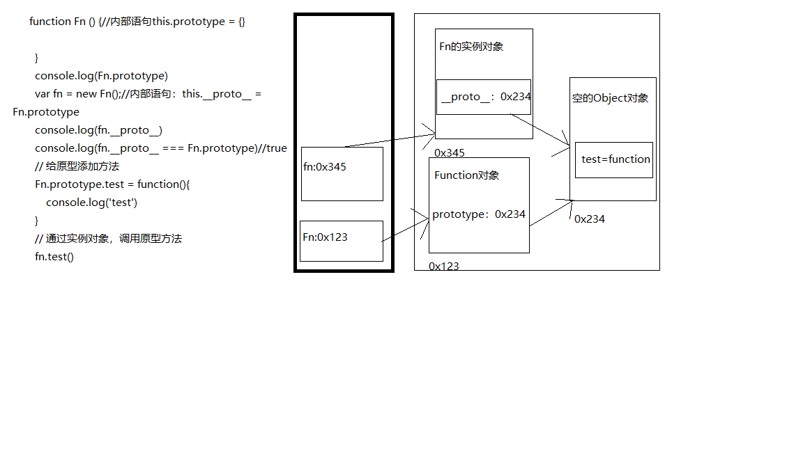
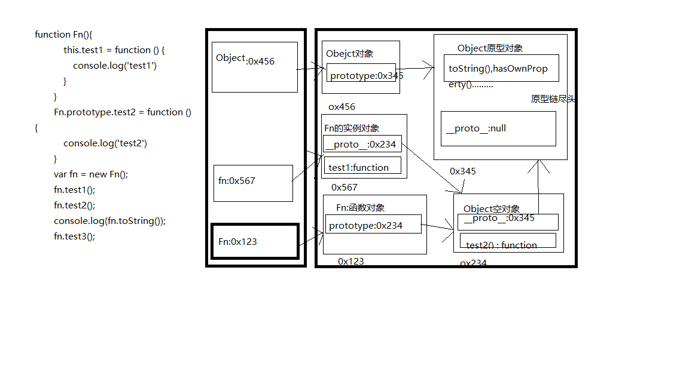

## 一、原型
* 每一个函数都有一个`prototype`属性，默认指向一个空的Object对象（即为：原型对象）
* 原型对象中的一个属性`constructor`，它指向函数对象
* 函数所有的实例对象都继承了原型对象中的属性方法
示例：
```js
// 每一个函数都有一个prototype属性，默认指向一个空的Object对象（即为：原型对象）
console.log(Date.prototype, typeof Date.prototype)
function Fun () {}
console.log(Fun.prototype) // 默认指向一个Object空对象

// 原型对象中有一个属性constructor，它指向函数对象
console.log(Date.prototype.constructor === Date)
console.log(Fun.prototype.constructor === Fun)

// 给原型对象添加属性（一般是方法）===》示例对象可以访问
Fun.prototype.name = function () {
    console.log('name()')
}
var fun1 = new Fun()
fun1.name()
```
## 二、显示原型和隐式原型
* 每一个函数都有一个`prototype`属性，即显示原型，默认指向一个Object对象
* 每一个实例对象都有一个`__proto__`，即隐式原型
* 对象的隐式原型的值为构造函数显示原型的值
示例：
```js
// 定义函数
function Fn () {
    // 内部语句this.prototype = {}
}
// 每一个函数都有一个prototype属性，即显示原型，默认指向一个Object对象
console.log(Fn.prototype)
// 每一个实例对象都有一个__proto__，即隐式原型
// 创建实例对象
var fn = new Fn() // 内部语句：this.__proto__ = Fn.prototype
console.log(fn.__proto__)
// 对象的隐式原型的值为构造函数显示原型的值
console.log(fn.__proto__ === Fn.prototype) // true
// 给原型链添加方法
Fn.prototype.name = function () {
    console.log('test')
}
// 通过实例对象调用原型链上的方法
fn.name()
```
图示：

## 三、原型链
* 访问一个对象属性时，先在自身属性中查找，如果没有，则沿着`__proto__`这条链向上查找，直到`Object.prototype`，如果还是没有，则返回`undefined`
* 别名：隐式原型链
* 作用：
    1. 查找对象属性，
    2. 查找变量：看作用域链
```js
function Fn() {
    this.test1 = function () {
        console.log('test1')
    }
}
Fn.prototype.test2 = function () {
    console.log('test2')
}
var fn = new Fn()
fn.test1()
fn.test2()
console.log(fn.toString())
// 1.函数的显示原型指向对象是默认空的Object实例对象（但Object不满足）
console.log(Fn.prototype instanceof Object) // true
console.log(Object.prototype instanceof Object) // false
console.log(Function.prototype instanceof Object) // true
// 2.所有函数都是Function的实例对象（包括Function本身）
console.log(Function._proto_ === Function.prototype) // true

// Object的原型对象是原型链的尽头
console.log(Object.prototype.__proto__) // null
```
图示：

## 四、原型链属性问题
* 读取对象属性值时，会自动到原型链中查找
* 设置对象属性值时，不会查找原型链，如果当前对象中没有此属性，则直接添加此属性，并设置此属性值
* 方法一般定义在原型中，属性一般都通过构造函数定义在对象本身
```js
function Fn() {

}
Fn.prototype.a = 'xxx'
var fn1 = new Fn()
console.log(fn1.a) // xxx
var fn2 = new Fn()
fn2.a = 'yyy'
console.log(fn1.a,fn2.a,fn2) // xxx, yyy, {a: 'yyy'}

function Person(name, age) {
    this.name = name
    this.age = age
}
Person.prototype.setName = function (name) {
    this.name = name
}
var p1 = new Person('tom',12)
p1.setName('jerry')
console.log(p1.name,p1.age) // jerry 12
var p2 = new Person('cat', 15)
p2.setName('json')
console.log(p2) // {name: "json", age: 15}
console.log(p1._proto_ === p2._proto_) // true // 对象的隐式原型 == 构造函数显示原型， p1和p2同一个构造函数
```
## 五、instanceof
### 5.1 instanceof如何判断
表达式： A(实例对象) `instanceof` B（构造函数）
如果b函数的显示原型对象在A对象的原型链上，返回`true`，否则返回`false`
### 5.2 Function 是通过new自己产生的实例
```js
    // 1
    function Foo(){}
    var f1 = new Foo();
    console.log(f1 instanceof Foo)// true
    console.log(f1 instanceof Object)// true

    // 2
    console.log(Object instanceof Function)// true
    console.log(Object instanceof Object)// true
    console.log(Function instanceof Object)// true
    console.log(Function instanceof Function)// true
    function Foo (){}
    console.log(Object instanceof Foo)// false
```