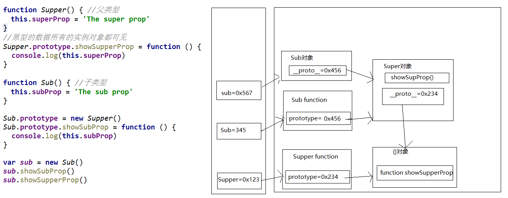

## 一、原型链继承
1. 定义父类型的构造函数
2. 给父类型的原型添加方法
3. 定义子类型的构造函数
4. 创建父类型的对象赋值给子类型的原型
5. 将子类型原型的构造属性设置子类型
6. 给子类型原型添加方法
7. 创建子类型的对象，可以调用父类型的方法。关键：子类型的原型为父类型的一个实例对象
```js
// 父类型
function Father() {
    this.fatherProp = 'this is father'
}
// 父类型原型添加方法
Father.prototype.showFatherProp = function () {
    console.log('this is fatherFun')
}
// 子类型
function Children() {
    this.childrenProp = 'this is children'
}
// 子类型的原型为父类型的一个实例对象
Children.prototype = new Father()
// 让子类型的原型的constructor指向子类型
Children.prototype.constructor = Children
// 子类型原型添加方法
Children.prototype.showChildrenProp = function() {
    console.log('this is childrenFun')
}

var children = new Children()
children.showFatherProp()
children.showChildrenProp()
console.log(children)
```

## 二、构造函数继承
1. 定义父类型构造函数
2. 定义子类型构造函数
3. 在子函数构造函数中调用父类型构造函数。**关键：在子类型构造函数中通用call()调用父类型构造函数**
```js
function Father(name, age) {
    this.name = name
    this.age = age
}
function Children(name, age, price) {
    Father.call(this, name, age) // 相当于this.Father(name,age)
    this.price = price
}
var children = new Children('孙悟空', 20, 2000)
console.log(children)
```

## 三、组合继承
原型链+构造函数的组合继承
1. 利用原型链实现父类型对象的方法继承
2. 利用super()借用父类型构造函数初始化相同属性
```js
function Person (name, age) {
    this.name = name
    this.age = age
}
Person.prototype.setName = function(name) {
    this.name = name
}
function Student (name, age, price){
    Person.call(this, name, age) // 为了得到属性
    this.price = price
}
Student.prototype = new Person(); // 为了能看到父类型的方法
Student.prototype.constructor = Student; // 修正constructor属性
Student.prototype.setPrice = function(price) {
    this.price = price
}

var s = new Student('tom', 20, 2000)
s.setName('bob')
s.setPrice(123123)
console.log(s.name, s.age, s.price)
```