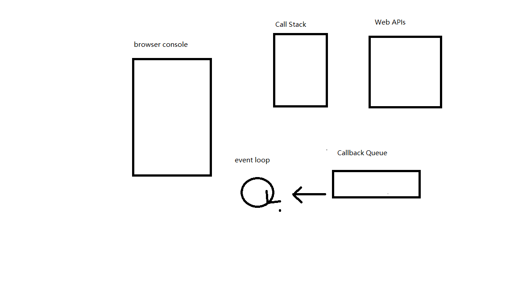
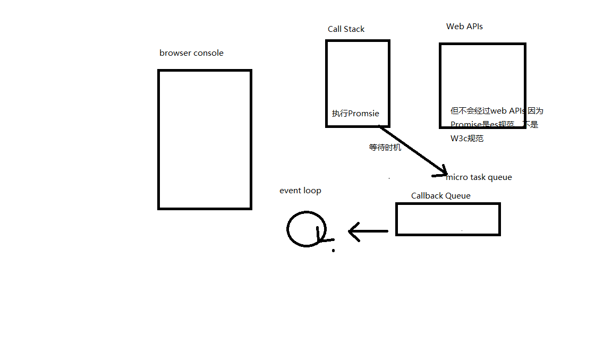

## 一、什么是Event Loop
1. event loop（事件循环/事件轮询）
2. js是单线程运行的，异步要基于回调来实现
3. event loop就是异步回调的实现原理
## 二、Event Loop执行过程
1. 同步代码，一行一行放在Call Stack中执行
2. 遇到异步，会先记录下，在web apis中，等待时机（定时器，网络请求）
3. 时机到了，就会移动到Callback Queue中
4. 如果Call Stack为空，即同步代码执行完成，event loop开始工作
5. 轮询查找Callback Queue，如果有则移动到Call Stack中执行
6. 然后继续轮询查找

示例：
```js
console.log('hi')
setTimeout(function cb1() {
	console.log('cb1')
})
console.log('Bye')
```
1. 执行第一行代码，第一行代码进入调用栈Call Stack中，调用栈执行，打印出hi，然后清空调用栈。
2. 然后执行第二行，setTimeout，把cb1函数放在定时器中，在webApi中，等待5秒后，进入到Callback Queue中
3. 执行第三行代码，推入调用栈中，打印bye，清空调用栈
4. 当Call Stack中没有代码能推进去时（同步代码执行结束），立刻启动event loop机制
5. event loop循环，进入到Callback Queue中查找。
6. 5秒后，定时器把cb1推入Callback Queue中，event loop把cb1推入Call Stack中，进行执行
## 三、DOM事件和event loop的关系
```js
<button id='btn1'>提交</button>
<script>
	console.log('hi')
	$('#btn1').click(function (e) {
		console.log('button clicked')
	})
	console.log('Bye')
</script>
```
和上面区别为：执行到click时，把回调函数存放到web apis中，等待用户点击，将回调函数推到Callback Queue中
DOM事件，异步都是基于event loop实现的。
## 四、微任务和宏任务
* 微任务microTask
* 宏任务macroTask
### 1. 什么是宏任务和微任务
* 宏任务：setTImeout，setInterval，Ajax，DOM事件
* 微任务：Promise，async/await
<p>微任务执行时机比宏任务早</p>

### 2.Event Loop和DOM渲染的关系
1. 在call stack空闲时
2. 尝试去进行DOM渲染
3. 然后在触发Event loop
### 3. 微任务和宏任务的区别
* 微任务：DOM渲染前触发，宏任务：DOM渲染后触发
* 微任务是es6规定的，宏任务是浏览器规定的
## 五、Event Loop 执行全过程，区别微任务和宏任务
<p>执行微任务时，会放到微任务的队列中。</p>
1. Call Stack 清空
2. 执行当前的微任务
3. 尝试渲染DOM
4. 触发Event Loop，执行宏任务。

