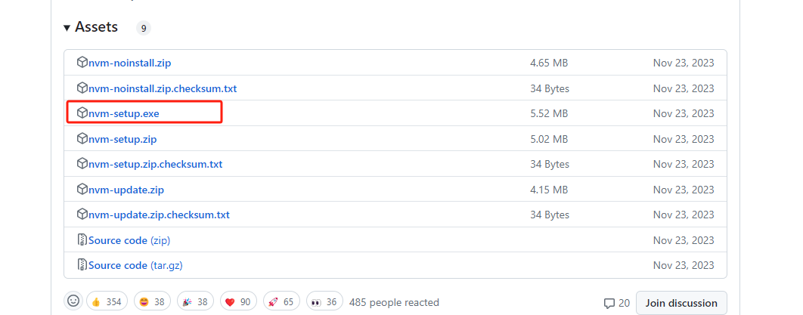
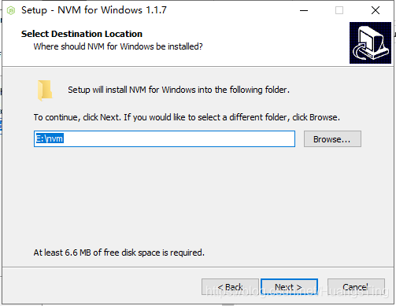
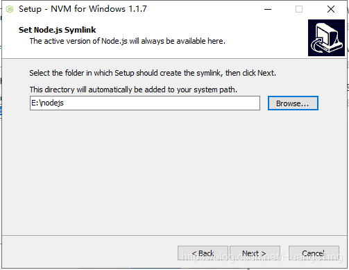
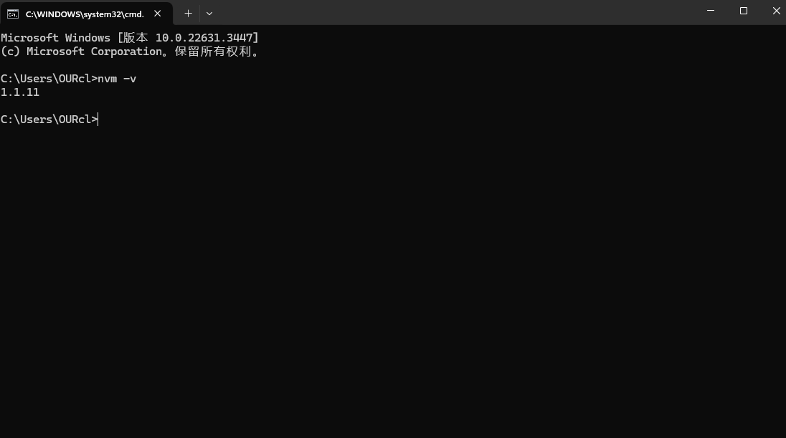
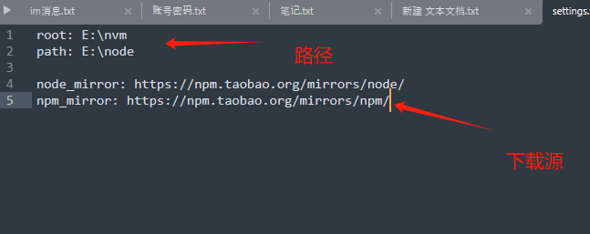

## 一、卸载node
已经安装node需要先卸载node。
## 二、安装nvm
nvm是一个node的版本管理工具，可以简单操作的切换、安装、查看。。。等等，与npm不同的是，npm是依赖包的管理工具。
### 1.去github[下载最新的nvm](https://github.com/coreybutler/nvm-windows/releases)。

### 2.现在nvm安装路径

### 3.选择node.js安装路径

### 4.通过nvm -v能查看版本号，证明安装成功

## 三、配置路径和下载源
```js
node_mirror: https://npm.taobao.org/mirrors/node/
npm_mirror: https://npm.taobao.org/mirrors/npm/
```

## 四、安装node
```js
* 在终端输入nvm list available，查看可以安装的版本
* nvm install 12.18.4 下载当前版本的node
* nvm use 12.18.4 切换当前版本
* 通过nvm list 查看当前已经安装的办，*号表示当前使用的node版本

```
## 五、nvm常用命令
| 命令                            |  说明                    |
| ------------------------------- |-----------------------  |
| nvm current                     |  查看当前版本            |
| nvm ls-remote                   | 查看远程版本             |
| nvm on                          | 开启node.js版本管理      |
| nvm off                         | 关闭node.js版本管理      |
| nvm proxy                       | 查看代理                 |
| nvm node_mirror [url]           | 设置node镜像             |
| nvm npm_mirror [url]            | 设置npm镜像              |
| nvm uninstall-checkpoint [num]  | 删除指定检查点            |
| nvm reinstall-checkpoint [num]  | 重新安装指定检查点        |
| nvm install-latest-npm          | 安装最新版本的npm         |
| nvm install-npm [version]       | 安装指定版本的npm         |
| nvm uninstall-npm               | 卸载当前使用的npm         |
| nvm use-latest-npm              | 使用最新版本的npm         |
| nvm root [path]                 | 设置存储不同版本node的目录 |
| nvm version [num]               | 显示nvm版本号             |
| nvm node_mirror [url]           | 设置node镜像              |
| nvm npm_mirror [url]            | 设置npm镜像               |
| nvm alias default 12.18.4       | 设置默认版本               |
