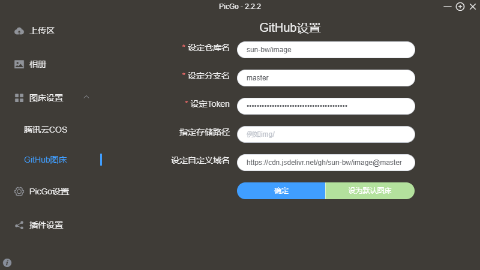

## 一、下载地址
PicGo下载地址：https://github.com/Molunerfinn/PicGo/releases
mac系统选择dmg下载，windows选择.exe系统
## 二、Github
使用github作为图床，说明一下具体用法。
登陆github，新建一个仓库（注：如果选择私有仓库，图片上传上去是不会显示的。）
创建好后，需要在 GitHub 上生成一个 token 以便 PicGo 来操作我们的仓库，来到个人中心，选择 Developer settings 就能看到 Personal access tokens，我们在这里创建需要的 token

点击Generate new token 创建一个新的token，选择 repo，同时它会把包含其中的都会勾选上，我们勾选这些就可以了。然后拉到最下方点击绿色按钮，Generate token 即可。之后就会生成一个 token ，记得复制保存到其他地方，这个 token 只显示一次！
## 三、配置PicGo
打开PicGo面板，选择github图床进行设置。

<ul>
<li>仓库名：仓库名</li>
<li>分支名：master</li>
<li>token：上一个咱们创建的token</li>
<li>注：仓库名的格式，是github的命/仓库名</li>
</ul>
点击确定即完成配置。

## 四、使用
接着打开上传区，把需要的图片拉进去，这里有三种上传图片的方式
* menubar 图标拖拽上传（仅支持 macOS）
* 主窗口拖拽或者选择图片上传
* 剪贴板图片（最常见的是截图）上传（支持自定义快捷键）

接着上传完成之后，我们到相册就会看到上传成功后的照片了，另外在自己的仓库里，也能够看到上传的图片
接着点击复制时，你会发现，它会给我们复制为 Markdown 的样式，如果你是在写 Markdown 的话，就不再需要再转化格式了。

## 五、github图床使用cdn加速

在自定义域名添加，https://cdn.jsdelivr.net/gh/sun-bw/image@master 
https://cdn.jsdelivr.net/gh 为jsdelivr官网github加速给连接 
sun-bw/image 存在github地址 
@master 存在master分支上 
具体如下图： 

## 六、gitee图床使用
* 下载插件github-plus
* 在gitee申请token
* 填写相应参数

token为申请的秘钥
repo为项目地址后面的路径