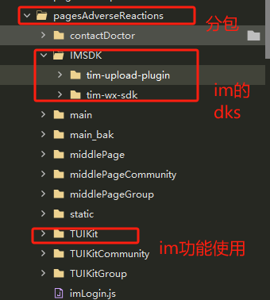
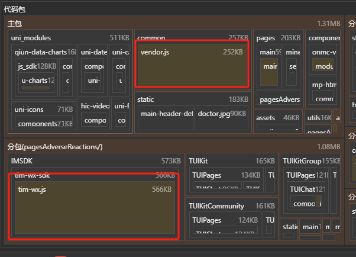

## 一、背景
微信小程序使用腾讯im聊天，通过npm引入依赖包，即便小程序使用分包，也会把node_module下的依赖，打包进到主包的vendor.js中，导致主包代码超过2M，不能发布小程序。

## 二、优化方案
### 1.配置vite.config.js文件
引入`npm install @rollup/plugin-commonjs`
```js
import { defineConfig } from 'vite';
import uni from '@dcloudio/vite-plugin-uni';
import commonjs from "@rollup/plugin-commonjs";
export default defineConfig({
	plugins: [uni(),
		commonjs() // 使rollup可以打包cjs规范的npm代码
	]
});
```
### 2.将node_modules下的微信im的skd，拷贝到im功能分包中。


### 3.在导入SDK时，指向拷贝目录的SDK

imLogin.js文件：
```
import TIM from "./IMSDK/tim-wx-sdk";
import TIMUploadPlugin from "./IMSDK/tim-upload-plugin";
```
### 4.主包引入分包的sdk依赖
```js
// ../../pagesAdverseReactions/IMSDK/tim-wx-sdk/tim-wx.js 指向分包的sdk
onShow(async () => {
    await require.async('../../pagesAdverseReactions/IMSDK/tim-wx-sdk/tim-wx.js').then(({ TIM }) => {
        console.log('im',TIM);
        types.value = TIM.TYPES;
        uni.$TIM = TIM;
    }).catch((err) => {
        console.log(err);
    });
})
```

### 5.最后
需要把node_modules下的依赖，删除。

im的sdk打包进入分包，主包的vendor.js体积也减少了。

## 三.SDK之间存在引入依赖关系
以集成TUICallKit为例：
### 1.npm下载之后，把node_modules中的相关依赖手动剪切到当前分包中。
### 2.安装依赖npm install @rollup/plugin-commonjs path -d
### 3.配置vite.config.js，设置别名，使当前依赖可以识别关联。
``` js
import {
	defineConfig
} from 'vite';
import uni from '@dcloudio/vite-plugin-uni';
import commonjs from "@rollup/plugin-commonjs";
import path from "path";
export default defineConfig({
	plugins: [uni(),
		commonjs() // 使rollup可以打包cjs规范的npm代码
	],
	resolve: {
		alias: { // im的依赖之间有互相的引用, 通过别名将彼此关联起来（因为别名和原名一致，node_modules的依赖需要删掉）
			"@tencentcloud": path.resolve(__dirname, "pagesAdverseReactions/@tencentcloud/"),
			"tim-upload-plugin": path.resolve(__dirname, "pagesAdverseReactions/@tencentcloud/tim-upload-plugin"),
			"tim-profanity-filter-plugin": path.resolve(__dirname,"pagesAdverseReactions/@tencentcloud/tim-profanity-filter-plugin"),
			"tuicall-engine-wx": path.resolve(__dirname,"pagesAdverseReactions/@tencentcloud/tuicall-engine-wx"),
			"tim-wx-sdk": path.resolve(__dirname,"pagesAdverseReactions/@tencentcloud/chat"),
			"trtc-wx-sdk": path.resolve(__dirname,"pagesAdverseReactions/@tencentcloud/trtc-wx-sdk"),
		}
	}
});
```
编译之后，会直接把TUICallKit相关依赖打到子包中，主包vendor.js体积也减少了。