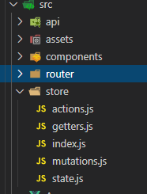
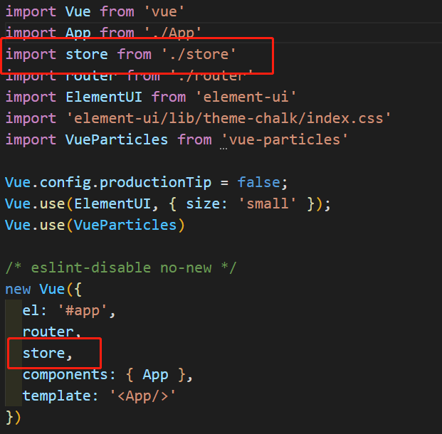

## 一、Vuex五个核心
* state：vue中的共享数据
* getters：vue中的计算属性，根据现有的state数据，进行二次计算。好比如computed。
* mutations：vue中的方法，可以改变state中的数据，但是不能直接操作state，需要通过commit触发。
* actions：异步代码。修改state中的数据，只能通过调用mutations修改。
* modules：仓库模块的拆分。
## 二、Vuex中的四个辅助函数
* mapState()：获取state中的数据，将state中的数据映射到当前组件的computed中。
* mapGetters()：获取getters中的数据，将getters中的数据映射到当前组件的computed中。
* mapMutations()：获取mutations中的同步方法，将mutations中的方法映射到当前组件的methods中。
* mapActions()：获取actions中的异步方法，将actions中的方法映射到当前组件的methods中。
## 三、Vuex使用
### 1. 在项目中安装Vuex
npm install vuex
### 2. 在src目录下创建store文件夹，在store文件夹下创建index.js文件

### 3. 在index.js文件中引入Vue和Vuex

### 4. 创建store仓库，并创建state、getters、mutations、actions、modules
index.js：
```js
import Vue from 'vue'
import Vuex from 'vuex'
Vue.use(Vuex)
//导入相应的模块，*相当于引入了这个组件下所有导出的实例
import state from './state'
import mutations from './mutations'
import * as actions from './actions'
import * as getters from './getters'

// 注册上面引入的模块，并导出
export default new Vuex.Store({
    state,
    actions,
    mutations,
    getters
})
```
state.js:
```js
//声明全局维护的状态
const state = {
    name:'tom',
    age:24,
}
export default state
```
getters.js:
```js
//获取最终的状态信息
export const name = (state) => state.name;
export const age = (state) => state.age;
```
mutations.js:
```js
//提交mutation更改Vuex状态的唯一合法方法
const modifyName = (state,name) => {
    console.log(888)
    state.name = name;//把传递过来的参数赋值给state中的name
}
const modifyAge = (state,age) => {
    console.log(888)
    state.age = age;
}

export default {modifyName,modifyAge}
```
actions.js:
```js
//action注册事件处理函数。当这个函数被触发的时候，将状态提交到mutation中处理
const modifyName = ({commit},name) => {//commit提交，name为传递过来的参数
    console.log(777)
    return commit('modifyName',name)
}
const modifyAge = ({commit},age) => {
    console.log(777)
    return commit('modifyAge',age)
}

export {modifyName,modifyAge}
```
## 四、在vue文件中获取更改Vuex的值
* 通过this.$store.commit()和…mapMutations调用mutations中的方法更改值,同步方法。
* 通过this.$store.dispatch()和…mapActions调用actions中的方法更改值，异步方法.
* 通过this.$store.state和…mapState取值Vuex中的值
* 通过this.$store.getters和…mapGetters取Vuex中的值
```js
import {mapState,mapMutations,mapGetters,mapActions} from 'vuex'
export default {
    computed:{
        ...mapState(['name','age']),
        ...mapGetters(['name','age'])
    },
    data(){
        return{

        }
    },
    methods:{
        ...mapActions(['modifyName']),
        ...mapMutations(['modifyAge']),
        btnFirst(){
            let name = 'tony'
            this.modifyName(name);
            console.log(this.name)
            // console.log(this.firstName)
        },
        btnSecond(){
            let age = 30
            this.modifyAge(age)
            console.log(this.age)
        },
        btnThird(){
            this.$store.commit('modifyAge','张飞')
        },
        btnFourth(){
            this.$store.dispatch('modifyAge',45)
        }
    }
}
```