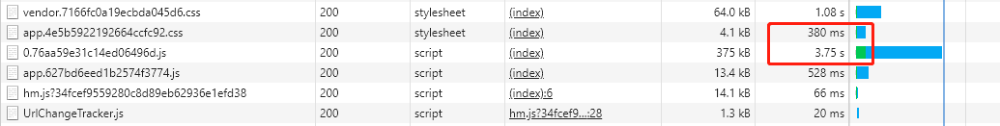
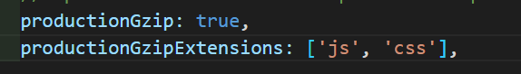
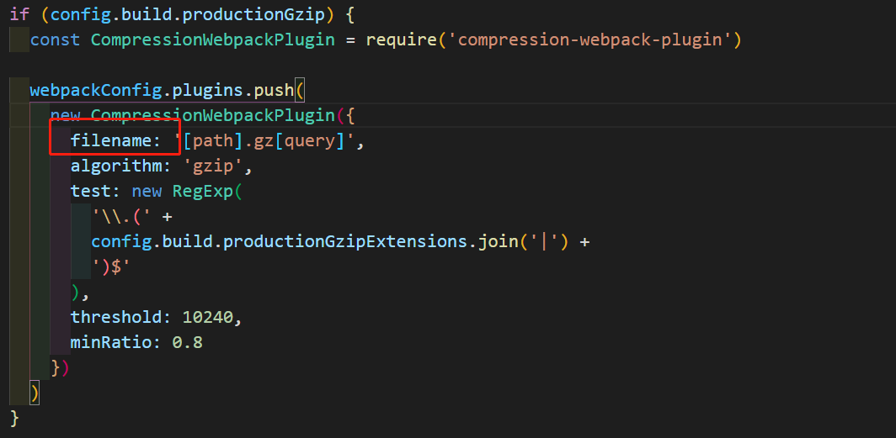
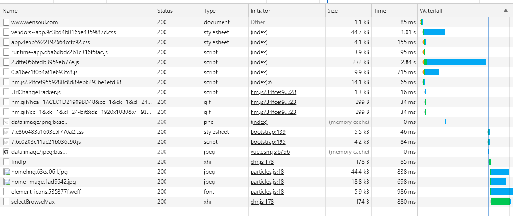
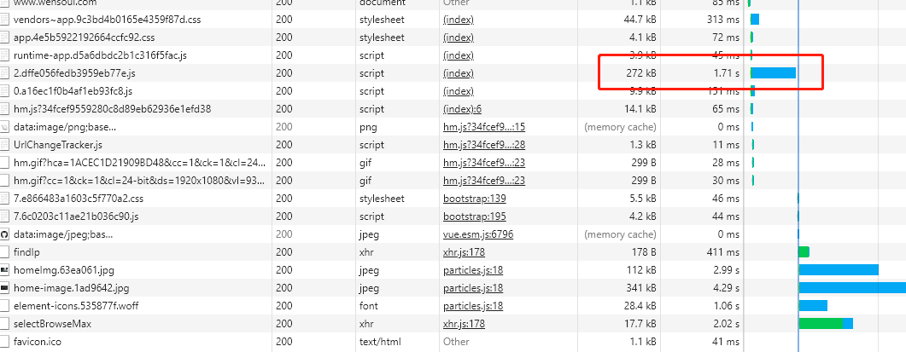
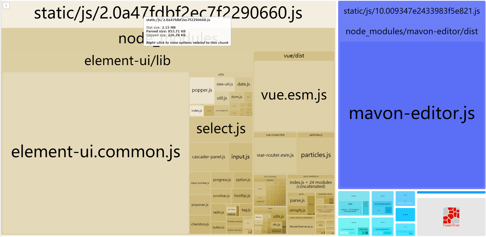
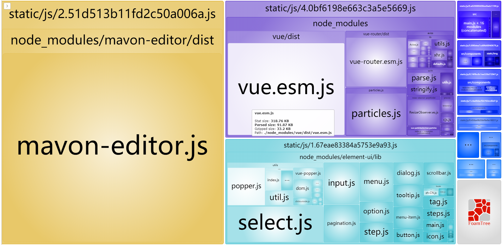
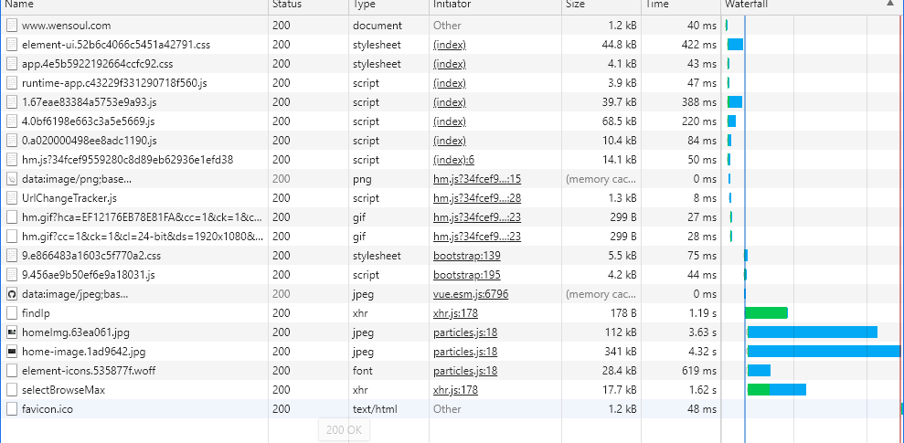
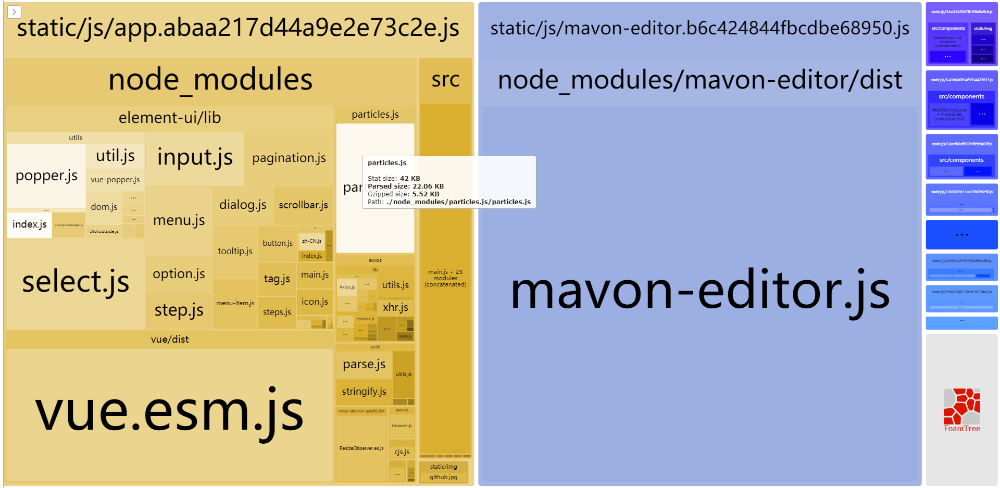

## 一、白屏原因
Vue等主流的当页面框架都是js渲染的。查找到，只有等0.76aa59e31c14ed06496d.js这个js文件加载结束，页面才会开始渲染，而这个js加载的时间平均在3.75s左右。所以造成了将近4s的白屏。

## 二、解决
### 1. 路由懒加载。
### 2. gzip打包压缩
    <p>Vue项目开启gzip压缩介绍</p>
    * 在config/index.js文件，开启productionGzip
        
    * 在webpack.prod.conf.js中把asset属性名修改为filename
        
    * 下载插件compression-webpack-plugin
        <p>npm install --save-dev compression-webpack-plugin</p>
    * 重新打包部署后，加载需要3m左右
        
### 3. 使用terser-webpack-plugin进行打包压缩
* 在webpack.prod.conf.js新增配置
```js
// 新的打包规则
optimization: {
    splitChunks: {
        chunks:'all',
    },
    // 将当前模块的记录其他模块的hash单独打包为一个文件 runtime
    // 解决：修改a文件导致b文件的contenthash变化
    runtimeChunk: {
        name: entrypoint => `runtime-${entrypoint.name}`
    },
    minimizer: [
        //配置生产环境的压缩方案：js和css
        new TerserWebpackPlugin({
            //开启缓存
            cache: true,
            //开启多进程打包
            parallel: true,
            //启动sourcemap
            sourceMap: true
        })
    ]
},
```
* 重新打包部署后，加载时间缩短在2s左右。

### 4. 构建结果输出分析：webpack-bundle-analyzer
在项目中webpack.prod.conf.js中配置
```js
if (config.build.bundleAnalyzerReport) {
    const BundleAnalyzerPlugin = require('webpack-bundle-analyzer').BundleAnalyzerPlugin
    webpackConfig.plugins.push(new BundleAnalyzerPlugin())
}
```
VUE脚手架已经配置好了。
直接执行`npm run build --report`，查看报告。

通过上图可以看出2.的文件，由于element-ui占比太多，导致文件太多，导致首次加载慢。
### 5. 将element-ui按需引入。然后将element-ui和其他大的引入文件分开打包。
在webpack.prod.conf.js中添加代码
```js
optimization: {
    splitChunks: {
        chunks:'all',
        cacheGroups: {
            //分离element-ui
            'element-ui': {
                name: 'element-ui',
                test: /[\\/]node_modules[\\/]element-ui[\\/]/,
                priority: -10
            },
            //分离mavon富文本
            'mavon-editor':{
                name: 'mavon-editor',
                test: /[\\/]node_modules[\\/]mavon-editor[\\/]/,
                priority: -10
            },
            vendors: {
                name:'vendors',
                test: /[\\/]node_modules[\\/]/,
                // 优先级
                priority: -20
            },
        }
    },
}
```
<p>其中name是指定打包之后的bundle文件名(如果无name配置，最后的bundle文件名就是外层的element-ui加上入口文件的组合，例如element-ui~index），test则是匹配需要分离的第三方库所在的目录，element-ui所在的目录是在/node_modules/element-ui/。priority指定打包的优先级，这个值必须要比vendors的打包优先级大，不然便无法成功分离指定的第三方库，他仍然会被打包到vendors中。</p>
<p>在执行npm run build --report查看打包报告</p>



<p>可以看出element已经被分离出来了。</p>
部署之后查看加载效果。



<p>首次加载，所有文件加载时间都小于1m，可以算是秒开了。还存在一个问题，由于首页存在图片过大，图片加载比较缓慢。接下下优化一下打包后的图片。之后还可以把vue，vuex，vue-router单独打包出来，应该会更好一些。</p>

### 6. 重新整理配置文件
```js
optimization: {
    splitChunks: {
        chunks:'all',
        cacheGroups: {
            'element-ui': {
                chunks:'async',
                name: 'element-ui',
                test: /[\\/]node_modules[\\/]element-ui[\\/]/,
                priority: -10
            },
            'mavon-editor':{
                chunks:'async',
                name: 'mavon-editor',
                test: /[\\/]node_modules[\\/]mavon-editor[\\/]/,
                priority: -10
            },
            vendors: {
                chunks:'all',
                name:'vendors',
                test: /(vue|vue-touter|axios)/,
                minChunks:2,
                // 优先级
                priority: -30
            },
        }
    }
},
```
打包之后

### 7. spiltchunks属性
```js
// 默认值，可以不写~
chunks:'all',//chunks: 表示显示块的范围，有三个可选值：initial(初始块)、async(按需加载块)、all(全部块)，默认为all;
minSize: 30 * 1024, // 分割的chunk最小为30kb
maxSize: 0, // 最大没有限制
minChunks: 1, // 要提取的chunk最少被引用1次
maxAsyncRequests: 5, // 按需加载时并行加载的文件的最大数量
maxInitialRequests: 3, // 入口js文件最大并行请求数量
automaticNameDelimiter: '~', // 名称连接符
name: true, // 可以使用命名规则
cacheGroups: {
    // 分割chunk的组
    // node_modules文件会被打包到 vendors 组的chunk中。--> vendors~xxx.js
    // 满足上面的公共规则，如：大小超过30kb，至少被引用一次。
    vendors: {
        test: /[\\/]node_modules[\\/]/,
        // 优先级
        priority: -10
    },
    default: {
        // 要提取的chunk最少被引用2次
        minChunks: 2,
        // 优先级
        priority: -20,
        // 如果当前要打包的模块，和之前已经被提取的模块是同一个，就会复用，而不是重新打包模块
        reuseExistingChunk: true
    }
}
```