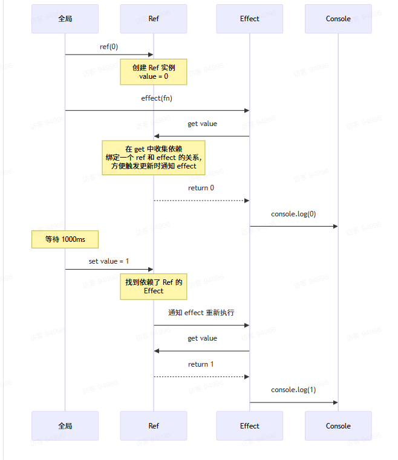

## 响应式最基础的实现 - ref
Vue 的响应式系统核心在于响应式对象的属性与 `effect` 副作用函数之间建立的依赖关系。让我们通过具体示例来理解这个概念：

在`reactivity`下创建目录`examples`，创建测试实例：
```html
<!doctype html>
<html lang="en">
    <head>
        <meta charset="UTF-8" />
        <meta name="viewport" content="width=device-width, initial-scale=1.0" />
        <title>Document</title>
    </head>
    <body>
        <script type="module">
            /**
             * 可以引用在主包下载的vue
             */
            // import {
            //     ref,
            //     effect,
            // } from '../../../node_modules/vue/dist/vue.esm-browser.prod.js'
            // 引用自己的vue
            import { ref, effect } from '../dist/reactivity.esm.js'

            console.log(ref, effect)
            const count = ref(0)
            debugger

            effect(() => {
                debugger
                console.log('effect', count.value)
            })

            setTimeout(() => {
                count.value = 1
                debugger
            }, 1000)
        </script>
    </body>
</html>

```
* **普通函数访问响应式数据**
```ts
import { ref } from 'vue'

const count = ref(0)

// 普通函数
function fn() {
  console.log(count.value)
}

fn() // 打印 0

setTimeout(() => {
  count.value = 1 // 修改值不会触发 fn 重新执行
}, 1000)

```
在这个例子中，虽然 `fn` 读取了响应式数据 `count.value`，但由于它不是在 `effect` 中执行的，因此当 `count.value` 发生变化时，该函数不会重新执行。

* **`effect`中访问响应式数据**
```ts
import { ref, effect } from 'vue'

const count = ref(0)

effect(() => {
  console.log(count.value) // 首次执行打印 0
})

setTimeout(() => {
  count.value = 1 // 触发 effect 重新执行，打印 1
}, 1000)
```
我们平时使用的 `computed、watch、watchEffect` 包括组件的 `render` 都是依赖于 `effect` 函数来收集依赖的<br/>
当在 effect 中访问响应式数据时，会发生以下过程：
* **依赖收集：** 当 `effect` 中的函数首次执行时，访问` count.value`会触发 `ref` 的 `get`，此时系统会自动收集当前`effect`作为依赖。
- **触发更新：** 当 `count.value` 被修改时，会触发 `ref` 的 `set`，系统会通知之前收集的所有依赖`（effect）`重新执行。

这就是为什么在第二个例子中，修改 `count.value` 会导致 `effect` 重新执行并打印新值。这种自动追踪依赖和触发更新的机制，正是 `Vue` 响应式系统的核心特征。
## 响应式数据 - ref
响应式 `Ref` 是一个包装器对象，它可以让我们追踪简单值的变化。
* `get`：当我们读取 `.value` 的时候，触发 `get` 此时在 `get` 中会收集依赖，也就是建立响应式数据和 `effect` 之间的关联关系
* `set`：当我们重新给`.value`赋值的时候，触发`set`，此时在`set`中会找到之前`get`的时候收集的依赖，触发更新。
* ref.ts
```ts
import { activeSub } from './effect'

enum ReactiveFlags {
  // 属性标记，用于表示对象是不是一个ref
  IS_REF = '__v_isRef'
}
class RefImpl() {
  // 保存实际的值
  _value
   // ref 标记，证明是一个 ref
  [ReactiveFlags.IS_REF] = true
  // 保存和 effect 之间的关联关系
  subs
  constructor(value) {
    // 收集依赖
    if(activeSub) {
      // 如果 activeSub 有，那就保存起来，等我更新的时候，触发
      this.subs = activeSub
    }
    return this._value = value
  }

  set value(newValue) {
    // 触发更新
    this._value = newValue
    // 通知 effect 重新执行，获取到最新的值
    this.subs?.()
  }

  get value() {

  }
}
export function ref(value) {
  return new RefImpl(value)
}

export function isRef(value) {
  return !!(value && value[ReactiveFlags.IS_REF])
}
```
## 副作用函数 (Effect)
副作用是指那些依赖响应式数据的函数，当数据发生变化时，这些函数会自动重新执行。
:::code-group
```ts [effect.ts]
// 当前正在收集的副作用函数，在模块中导出变量，这个时候当我执行 effect 的时候，我就把当前正在执行的函数，放到 activeSub 中，当然这么做只是为了我们在收集依赖的时候能找到它，如果你还是不理解，那你就把他想象成一个全局变量，这个时候如果执行 effect 那全局变量上就有一个正在执行的函数，就是 activeSub
export let activeSub

export function effect(fn) {
// 设置当前活跃的副作用函数，方便在 get 中收集依赖
  activeSub = fn
   // 执行副作用函数，此时会触发依赖收集
  fn()
  // 清空当前活跃的副作用函数
  activeSub = undefined
}
```
这段代码实现了一个简单的响应式系统，它能够让我们追踪数据的变化并自动执行相关的更新操作。
```ts
const count = ref(0)

effect(() => {
  console.log(count.value) // 这个函数会在 count.value 变化时自动重新执行
})

setTimeout(() => {
  count.value = 1
}, 1000)
```
上面这段代码的运行时序图:
