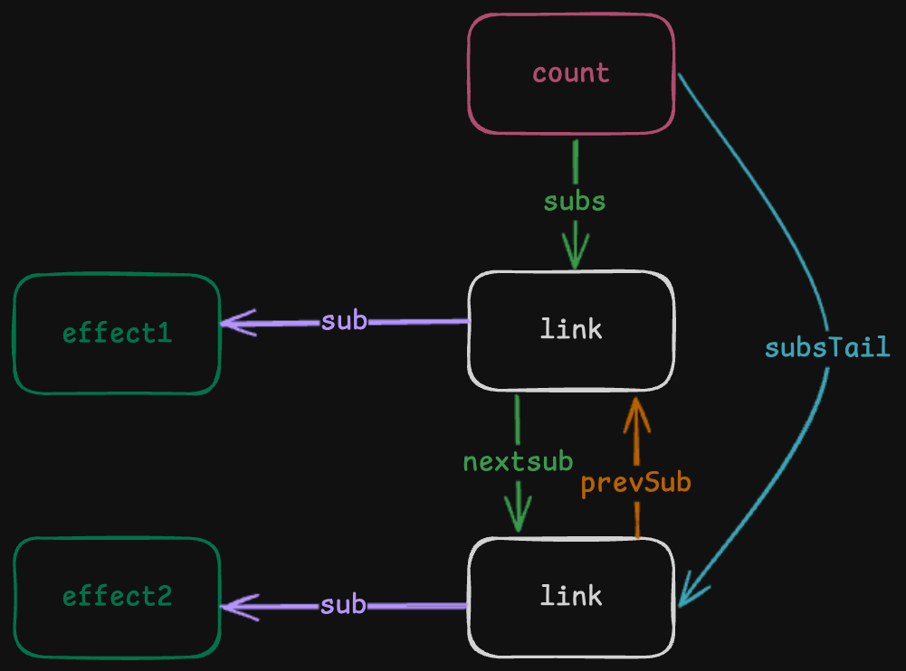

首先创建一个接口
* system.ts
```ts
export interface Link {
    // 保存当前要关联的 effect
    sub: Function,
    // 链表的下一个节点
    nextSub: Link,
    // 链表的上一个节点
    prevSub: Link
}
```
然后把`RefImpl`中的`subs`结构修改成`link`
* ref.ts
```ts
import { activeSub } from './effect'
import { link, propagate, Link } from './system'
class RefImpl {
    // 保存实际的值
    _value

     /**
   * 订阅者链表的头节点，理解为我们将的 head
   */
    subs: Link
    /**
     * 订阅者链表的尾节点，理解为我们讲的 tail
     */
    subsTail: Link

    constructor(value) {
        this._value = value
    }

    get value() {
        // 收集依赖
        if(activeSub) {
            trackRef(this)
        }
        return this._value
    }

    set value(newValue) {
        // 触发更新
        this._value = newValue
        triggerRef(this)
    }
}
```
这里我们添加了一个 `subsTail` 属性，用来保存尾节点
我们会调用 `trackRef` 函数收集依赖，调用 `triggerRef` 函数触发更新
* ref.ts
```ts
/**
 * 收集依赖，建立 ref 和 effect 之间的链表关系
 * @param dep
 */
export function trackRef(dep) {
    if(activeSub) {
        link(dep, activeSub)
    }
}

/**
 * 触发 ref 关联的 effect 重新执行
 * @param dep
 */
export function triggerRef(dep) {
    if(dep.subs) {
        propagate(dep.subs)
    }
}
```
* system.ts
```ts
/**
 * 链接链表关系
 * @param dep
 * @param sub
 */
export function link(dep, sub) {
    // 如果 activeSub 有，那就保存起来，等我更新的时候，触发
    const newLink  = {
        sub,
        nextSub: undefined,
        pervSub: undefined
    }
    /**
     * 关联链表关系，分两种情况
     * 1. 尾节点有，那就往尾节点后面加
     * 2. 如果尾节点没有，则表示第一次关联，那就往头节点加，头尾相同
     */
    if(dep.subsTail) {
        dep.subsTail.nextSub = newLink
        newLink.pervSub = dep.subsTail
        dep.subsTail = newLink
    } else {
        dep.subs = newLink
        dep.subsTail = newLink
    }
}

/**
 * 传播更新的函数
 * @param subs
 */
export function propagate(subs) {
    let link = subs
    let queuedEffect = []
    while (link) {
        queuedEffect.push(link.sub)
        link = link.nextSub
    }

    queuedEffect.forEach((effect) => effect())
}
```
在这里，我们将关联关系的数据结构，做成双向链表，这样修改后，收集依赖就变成了下面的样子
```ts
const count = ref(0)

const effect1 = effect(() => {
    count.value
})

effect2 = effect(() => {
    count.value
})

setTimeout(() => {
    count.value = 1
}, 1000)
```
代码执行完成后，关联关系如下：

图中展示了`count`作为一个响应式数据源，如何与两个副作用`effect1`和`effect2`进行关联。

在这张图中，`count`表示响应式数据`ref`，`effect1`和`effect2`表示副作用函数

`count`通过`subs`指向了一个`link`节点，这个节点`sub`指向了`effect1`，这个`link`节点有一个`nextSub`属性，指向链表的下一个节点`link2`，`link2`的`sub`指向`effect2`，当一秒钟智之后执行`count.value = 1`的时候，会触发`ref`的`set`，在`set`中我们通过`subs`遍历整个链表，找到了`effect1`和`effect2`，通知他们重新执行，在重新执行过程中，会获取到最新的数据。