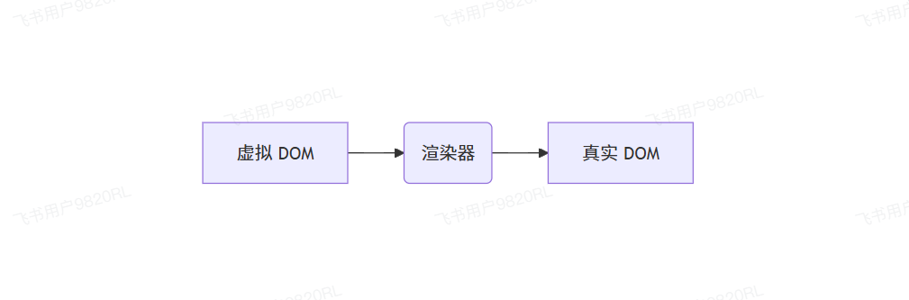

### 虚拟dom概念
虚拟`DOM`就是用`js`对象描述一个`DOM`，Vue最终会把这个虚拟`DOM`创建出一个真实的`DOM`挂载到页面上。

在vue中一般通过`h`函数来创建虚拟`DOM`：
```ts
const vnode = h('div','hello world')
```
这样就创建了一个虚拟DOM，这个虚拟DOM是一个div元素，它的内容是hello world。那它是如何渲染到页面呢？

vue是通过一个渲染器，将虚拟节点转换为真实节点。

### 渲染器
#### 什么是渲染器
vue是通过虚拟DOM来创建出真实的DOM的，虚拟DOM如何产生真实DOM。就是利用**渲染器**，它的工作流程如下：


#### 认识渲染器
其实`runtime-dom`这个模块的只要功能，就是提供渲染器。
```ts
import { render, h} from 'vue'

// 创建一个虚拟dom
const vnode = h('div', 'hello world')

// 将虚拟dom渲染到id为app的元素中
render(vnode, document.querySelector('#app'))
```

### 整体架构
vue的渲染器主要负责将虚拟DOM转换为真实DOM，核心包含一下几个部分：
1. `renderOptions`： 渲染i配置项，包含所有DOM操作的方法
2. `nodeOps`：封装了原生DOM API
3. `patchProp`：负责处理元素属性的更新

#### 1. 节点操作（nodesOps）
由于虚拟dom可以跨平台，所以不会在运行时直接操作dom，针对节点操作，更倾向于各个平台自助传递节点操作的API，当然`runtime-dom`是vue内部提供的浏览器DOM操作API。

`nodeOps`封装了所有`DOM`节点的基础操作，包括：
* `insert`：插入节点
* `createElement`：创建元素
* `remove`：移除元素
* `setElementText`：设置元素文本内容
* `createText`：创建文本节点
* `setText`：设置节点文本
* `parentNode`：获取父节点
* `nextSibling`：获取下一个兄弟节点
* `querySelector`：DOM查询
```ts
// time-dom/src/nodeOps.ts

/**
 * 封装dom节点操作的API
 */
export const nodeOps = {
    // 插入节点
    insert(el, parent, anchor) {
        // insertBefore 如果第二个参数为 null，那它就等于 appendChild
        parent.insertBefore(el, anchor || null)
    },
    // 创建元素
    createElement(type) {
        return document.createElement(type)
    },
    // 移除元素
    remove(el) {
        const parentNode = el.parentNode
        if (parentNode) {
        parentNode.removeChild(el)
        }
    },
    // 设置元素的 text
    setElementText(el, text) {
        el.textContent = text
    },
    // 创建文本节点
    createText(text) {
        return document.createTextNode(text)
    },
    // 设置 nodeValue
    setText(node, text) {
        return (node.nodeValue = text)
    },
    // 获取到父节点
    parentNode(el) {
        return el.parentNode
    },
    // 获取到下一个兄弟节点
    nextSibling(el) {
        return el.nextSibling
    },
    // dom 查询
    querySelector(selector) {
        return document.querySelector(selector)
    }
}
```
#### 2. 属性更新（patchProp）
属性更新为四大类：
1. 类名更新(patchClass)
```ts
// runtime-dom/src/modules/patchClass.ts
export function patchClass(el, value) {
    if(value == undefined) {
        // null undefined 那就理解为要移出
        el.removeAttribute('class')
    } else {
        el.className = value
    }
}
```
2. 样式更新（patchStyle）
```ts
// runtime-dom/src/modules/patchStyle.ts

export function patchStyle(el, prevValue, nextValue) {
    const style = el.style
    if (nextValue) {
        /**
         * 把新的样式全部生效，设置到 style 中
         */
        for (const key in nextValue) {
            style[key] = nextValue[key]
        }
    }

    if (prevValue) {
        /**
         * 把之前有的，但是现在没有的，给它删掉
         * 之前是 { background:'red' } => { color:'red' } 就要把 backgroundColor 删掉，把 color 应用上
         */
        for (const key in prevValue) {
            if (!(key in nextValue)) {
                style[key] = null
            }
        }
    }
}
```
3. 事件处理（patchEvent）
不直接绑定用户传递的事件函数，而是将事件绑定到一个对象的属性中，每次更新的时候，只需要更新这个对象的属性，就可以轻松的完成事件换绑
```ts
// runtime-dom/src/modules/events.ts

function createInvoker(value) {
    /**
     * 创建一个事件处理函数，内部调用 invoker.value
     * 如果需要更新事件，那后面直接修改 invoker.value 就可以完成事件换绑
     * @param e
     */
    const invoker = (e) => {
        invoker.value(e)
    }
    invoker.value = value
    return invoker
}

const veiKey = Symbol('_vei')

/**
 * const fn1 = ()=>{ console.log('更新之前的') }
 * const fn2 = ()=>{ console.log('更新之后的') }
 * click el.addEventListener('click',(e)=> { fn2(e) })
 */
export function patchEvent(el, rawName, nextValue) {
    const name = rawName.slice(2).toLowerCase()
    const invokers = (el[veiKey] ??= {}) // 等于 el._vei = el._vei ?? {}

    // 拿到之前绑定的 invoker
    const existingInvoker = invokers[rawName]
    if (nextValue) {
        if (existingInvoker) {
            // 如果之前绑定了，那就更新 invoker.value 完成事件换绑
            existingInvoker.value = nextValue
            return
        }
        // 创建一个新的 invoker
        const invoker = createInvoker(nextValue)
        // 放到 invokers 里面去，就是 el._vei 对象
        invokers[rawName] = invoker
        // 绑定事件，事件处理函数是 invoker
        el.addEventListener(name, invoker)
    } else {
        /**
         * 如果新的事件没有，老的有，就移除事件
         */
        if (existingInvoker) {
            el.removeEventListener(name, existingInvoker)
            invokers[rawName] = undefined
        }
    }
}
```
4. 普通属性更新（patchAttr）
```ts
// runtime-dom/src/modules/patchAttr.ts

export function patchAttr(el, key, value) {
    if (value == undefined) {
        // null undefined 那就理解为要移除
        el.removeAttribute(key)
    } else {
        el.setAttribute(key, value)
    }
}
```
5. patchProp
前面几个函数，需要在patchProp中使用
```ts
// runtime-dom/src/patchProp.ts

import { patchClass } from './modules/patchClass'
import { patchStyle } from './modules/patchStyle'
import { patchEvent } from './modules/events'
import { patchAttr } from './modules/patchAttr'

/**
 * 1. class
 * 2. style
 * 3. event
 * 4. attr
 */
export function patchProp(el, key, prevValue, nextValue) {
    if (key === 'class') {
        return patchClass(el, nextValue)
    }

    if (key === 'style') {
        return patchStyle(el, prevValue, nextValue)
    }

    // @click => onClick
    if (/^on[A-Z]/.test(key)) {
        return patchEvent(el, key, nextValue)
    }

    patchAttr(el, key, nextValue)
}
```

### runtime-dom的职责
`runtime-dom`就是提供浏览器内置的DOM操作API，并且它会根据`runtime-core`提供的`createRenderer`函数，创建一个渲染器，这个渲染器需要用到`DOM`操作的`API`，所以只需要调用`createRenderer`将`nodeOps`和`patchProp`传递过去就行
```ts
// runtime-dom/src/index.ts

import { nodeOps } from './nodeOps'
import { patchProp } from './patchProp'
// 注意，这个模块我们还没完成
import { createRenderer } from '@vue/runtime-core'

export * from '@vue/runtime-core'

const renderOptions = { patchProp, ...nodeOps }
const renderer = createRenderer(renderOptions)

export function render(vnode, container) {
    return renderer.render(vnode, container)
}
```