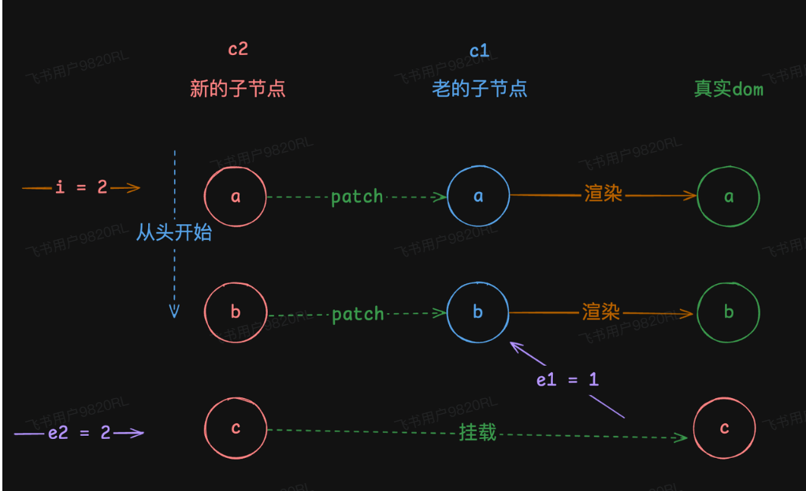
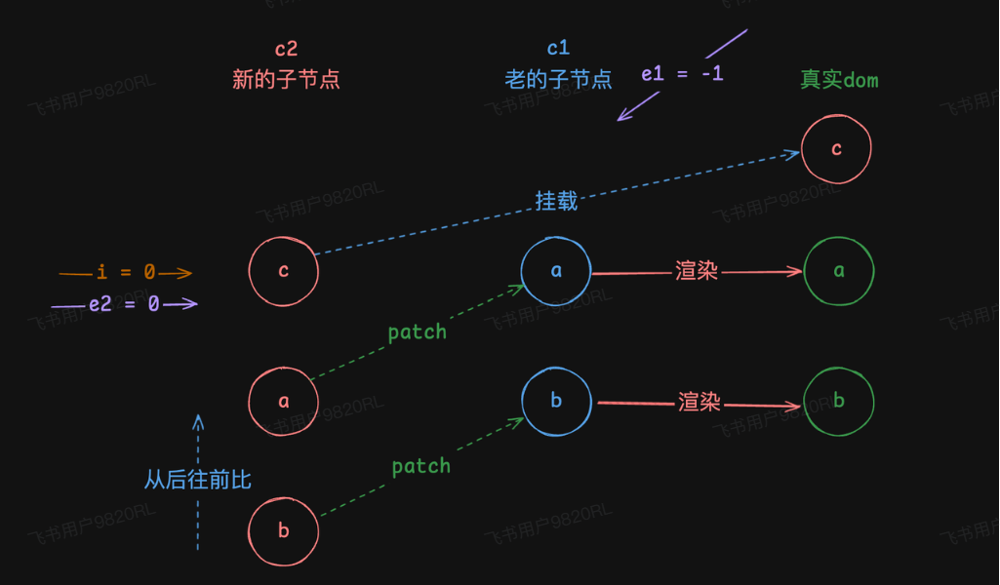
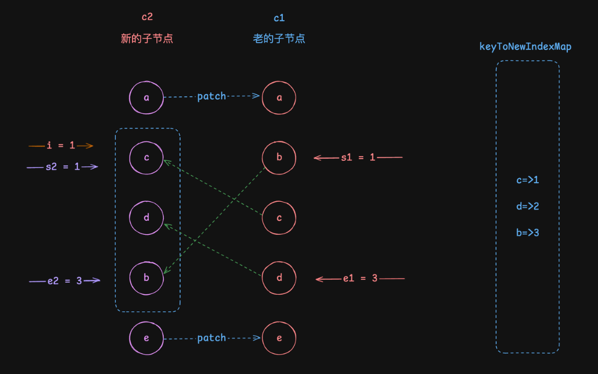
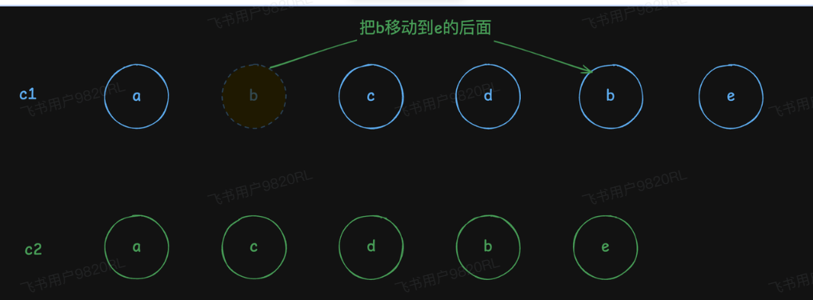

### 一、全量diff
全量diff主要是针对两个子节点都是数组的情况，需要对它所有的子元素进行全量更新，这种情况更新非常消耗性能，在vue中会尝试尽可能的复用dom，来进行更新。

#### 双端diff
##### 头部对比
头部对比的场景，假设子节点是通过`v-for`渲染出来的，最开始数组为`[a, b]`，然后`push`了一个`c`进去：
* `c1 = [a, b]`
* `c2 = [a, b, c]`
此时只需要从头开始进行对比就可以，`c1`的第一个为`a`，`c2`的第一个也是`a`，他们的`key`都是可以对应上的，所以依次对比`a`和`b`，到`c`之后，发现`c1`里面没有`c`，则直接挂载新的子节点就可以。如图：

实现代码：
```ts
const patchChildren = (n1, n2) => {
    const el = n2.el
    /**
     * 1. 新节点n2的子节点是文本
     *  1.1 老的是数组
     *  1.2 老的也是文本
     * 2. 新节点子节点是数组 或者null
     *  2.1 老的也是数组
     *  2.2 老的是文本
     *  2.3 老的可能是null
     */
    const prevShapeFlag = n1.shapeFlag
    const shapeFlag = n2.shapeFlag
    // 新的是文本
    if (shapeFlag & ShapeFlags.TEXT_CHILDREN) {
        // 老的是数组，卸载掉老的
        if (prevShapeFlag & ShapeFlags.ARRAY_CHILDREN) {
            unmountChildren(n1.children)
        }
        // 如果n1 和n2的children不一样， 进行设置文本
        if (n1.children !== n2.children) {
            hostSetElementText(el, n2.children)
        }
    } else {
        // 老的有可能是数组或者null 或者文本
        // 新的是数组,或者null, 老的也有可能是null

        // 老的是文本
        if (prevShapeFlag & ShapeFlags.TEXT_CHILDREN) {
            // 把老的子元素节点干掉
            hostSetElementText(el, '')
            if (shapeFlag & ShapeFlags.ARRAY_CHILDREN) {
                // 挂载新的节点
                mountChildren(n2.children, el)
            }
        } else {
            // 老的数组或者null
            // 新的是数组或者null
            if (prevShapeFlag & ShapeFlags.ARRAY_CHILDREN) {
                // 老的是数组
                if (shapeFlag & ShapeFlags.ARRAY_CHILDREN) {
                    // 新的也是数组， 全量diff
                    patchKeyedChildren(n1.children, n2.children, el)  // [!code ++]
                } else {
                    // 新的不是数组，卸载老的数组
                    unmountChildren(n1.children)
                }
            } else {
                // 老的是null
                if (shapeFlag & ShapeFlags.ARRAY_CHILDREN) {
                    // 新的是数组
                    mountChildren(n2.children, el)
                }
            }
        }
    }
}
const patchKeyedChildren = (c1, c2, container) => {
    // 开始对比下标
    let i = 0

    // 老的子节点的最后一个元素下标
    let e1 = c1.length - 1

    // 新的子节点最后一个元素下标
    let e2 = c2.length - 1

    /**
     * 头部对比
     * c1 = [a,b]
     * c2 = [a,b,c]
     *
     * 开始时： i=0 ，e1=1,e2=2
     * 结束时： i=2,e1=1,e2=2
     */
    while(i <= e1 && i <= e2) {
        const n1 = c1[i]
        const n2 = c2[i]

        if(isSameVNodeType(n1, n2)) {
            // 如果n1和n2是同一个类型的子节点，那就可以更新，更新完了对比下一个
            patch(n1, n2, container)
        } else {
            break
        }
        i++
    }
}
```
##### 尾部对比
除了头部对比，实际中，不一定只是向尾部添加元素，还有可能往头部添加，比如`unshift`，往头部添加一个子节点`c`：
* `c1 = [a, b]`
* `c2 = [c, a, b]`
此时明显头部对比就对比不上了，因为`c1`的第一项是`a`，`c2`的第一项是`c`，在头部对比的代码中第一次就会被`break`，但是头部虽然对比不上，尾部是可以对比的，比如`c1`的最后一项是`b`，`c2`的最后一项也是`b`，那么就可以倒着比：如图：

实现代码：
```ts
    // 开始对比的下标
    let i = 0

    // 老的子节点的最后一个元素的下标
    let e1 = c1.length - 1

    // 新的子节点的最后一个元素的下标
    let e2 = c2.length - 1

    /* 省略头部对比的代码 */
    /**
     * * 1.2 尾部对比
     *
     * c1 => [a, b]
     * c2 => [c, d, a, b]
     * 开始时：i = 0, e1 = 1, e2 = 3
     * 结束时：i = 0，e1 = -1, e2 = 1
     */
    while(i <= e1 && i <= e2) {
        const n1 = c1[e1]
        const n2 = c2[e2]
        if(isSameVNodeType(n1, n2)) {
            patch(n1, n2, container)
        } else {
            break
        }
        // 更新尾指针
        e1--
        e2--
    }
```
##### 结论
当双端`diff`完成后，可以得出一下结论：
* 当`i > e1`的时候，表示**新的子节点多，老的子节点少，**所以需要插入新的子节点。插入范围**`i - e2`**
* 当`e > e2`的时候，表示**老的多，新的少**，需要将老的子节点中多余的卸载掉。
```ts
if (i > e1) {
    /**
     * 根据双端对比，得出结论：
     * i > e1 表示老的少，新的多，要挂载新的，挂载的范围是 i - e2
     */
    const nextPos = e2 + 1
    // 由于挂载不一定是追加到父元素的最后面，所以此处需要获取到 anchor，插入到某个元素之前
    const anchor = nextPos < c2.length ? c2[nextPos].el : null
    console.log(anchor)
    while (i <= e2) {
        patch(null, c2[i], container, anchor)
        i++
    }
} else if (i > e2) {
    /**
     * 根据双端对比，得出结果：
     * i > e2 的情况下，表示老的多，新的少，要把老的里面多余的卸载掉，卸载的范围是 i - e1
     */
    while (i <= e1) {
        unmount(c1[i])
        i++
    }
}
```
获取到了`anchor`，是因为每次更新不一定是插入到元素的最后，比如：
* `c1 = [a, b]`
* `c2 = [c, a, b]`
这种情况下，`c`肯定是要插入到`a`之前，所以需要想办法拿到`a`，对比结束后，`e1`应该等于`c`的索引，那么`a`的索引应该是`e2 + 1`。通过索引拿到`anchor`，传递给`patch`，从`patch`到`mountElement`之间所有调用将传递`anchor`。

### 二、乱序diff
如果数据顺序是乱的。
```ts
// c1 => [a, b, c, d, e]
const vnode1 = h('div', [
    h('p', { key: 'a', style: { color: 'blue' } }, 'a'),
    h('p', { key: 'b', style: { color: 'blue' } }, 'b'),
    h('p', { key: 'c', style: { color: 'blue' } }, 'c'),
    h('p', { key: 'd', style: { color: 'blue' } }, 'd'),
    h('p', { key: 'e', style: { color: 'blue' } }, 'e')
])

// c2 => [a, c, d, b, e]
const vnode2 = h('div', [
    h('p', { key: 'a', style: { color: 'red' } }, 'a'),
    h('p', { key: 'c', style: { color: 'red' } }, 'c'),
    h('p', { key: 'd', style: { color: 'red' } }, 'd'),
    h('p', { key: 'b', style: { color: 'red' } }, 'b'),
    h('p', { key: 'e', style: { color: 'red' } }, 'e')
])

render(vnode1, app)

setTimeout(() => {
    render(vnode2, app)
}, 1000)
```
在这组数据红，可以看到，数据从`[a, b, c, d, e]`变成`[a, c, d, b, e]`，这样的话顺序就发生了变化，但是这些`key`还是在的，所以就需要去找对应的`key`，进行`patch`。

当双端对比结束后，此时`i = 1,e1 = 3, e2 = 3`，此时`i`既不大于`e1`，也不小于`e2`，中间还有三个没有对比完，但是这些`key`还是在的，所以需要到`c1`中找到对应的`key`的虚拟节点，进行`patch`：
```ts
// 老的子节点开始查找的位置 s1 - e1let s1 = i
// 新的子节点开始查找的位置 s2 - e2let s2 = i

/**
 * 做一份新的子节点的key和index之间的映射关系
 * map = {
 *   c:1,
 *   d:2, *   b:3 * }
 */
const keyToNewIndexMap = new Map()
/**
 * 遍历新的 s2 - e2 之间，这些是还没更新的，做一份 key => index map
 */
for(let j = s2; j <= e2; j++) {
    const n2 = c2[j]
    keyToNewIndexMap.set(n2.key, j)
}
/**
 * 遍历老的子节点
 */
for(let j = s1; j <= e1; j++) {
    const n1 = c1[j]
    const newIndex = keyToNewIndexMap.get(n1.key)
    if(newIndex != null) {
        patch(n1, c2[newIndex], container)
    } else {
        unmount(n1)
    }
}
```
在这段代码红，声明了一个`keyToNewIndexMap`用来保存`c2`中的`key`对应的`index`，这样后续就可以快速通过这个`key`找到对应的虚拟节点进行`patch`。但是目前顺序还是不对，需要遍历新的子节点，将每个子节点插入到正确的位置：
```ts
/**
 * 1. 遍历新的子元素，调整顺序，倒序插入
 * 2. 新的有，老的没有的，我们需要重新挂载
 */
for (let j = e2; j >= s2; j--) {
    /**
     * 倒序插入
     */
    const n2 = c2[j]
    // 拿到它的下一个子元素
    const anchor = c2[j + 1]?.el || null
    if (n2.el) {
        // 依次进行倒序插入，保证顺序的一致性
        hostInsert(n2.el, container, anchor)
    } else {
        // 新的有，老的没有，重新挂载
        patch(null, n2, container, anchor)
    }
}
```
至此，真实 `dom` 更新完毕，顺序也 ok！

#### 完整代码：
```ts
export function createRenderer(options) {
    // 虚拟节点渲染到页面的功能

    const {
        createElement: hostCreateElement,
        insert: hostInsert,
        remove: hostRemove,
        setElementText: hostSetElementText,
        createText: hostCreateText,
        setText: hostSetText,
        parentNode: hostParentNode,
        nextSibling: hostNextSibling,
        patchProp: hostPatchProp,
    } = options

    // 卸载子元素
    const unmountChildren = children => {
        for (let i = 0; i < children.length; i++) {
            const child = children[i]
            // 递归挂载子节点
            unmount(child)
        }
    }
    // 卸载
    const unmount = vnode => {
        const { type, shapeFlag, children } = vnode

        if (shapeFlag & ShapeFlags.ARRAY_CHILDREN) {
            // 子节点是数组
            unmountChildren(children)
        }
        // 移除dom元素
        hostRemove(vnode.el)
    }

    // 挂载子元素
    const mountChildren = (children, el) => {
        for (let i = 0; i < children.length; i++) {
            const child = children[i]
            // 递归挂载子节点
            patch(null, child, el)
        }
    }

    // 挂载
    const mountElement = (vnode, container, anchor) => {
        /**
         * 1. 创建一个dom节点
         * 2. 设置他的props
         * 3. 挂载子节点
         */
        const { type, props, children, shapeFlag } = vnode

        // 创建dom节点  type= div， p span
        const el = hostCreateElement(type)
        // 更新的时候复用，卸载的时候用el，删除这个el，完成卸载
        vnode.el = el

        // 设置props
        if (props) {
            for (const key in props) {
                hostPatchProp(el, key, null, props[key])
            }
        }

        // 挂载子节点
        if (shapeFlag & ShapeFlags.TEXT_CHILDREN) {
            // 子节点是文本
            hostSetElementText(el, children)
        } else {
            // 子节点是数组
            if (shapeFlag & ShapeFlags.ARRAY_CHILDREN) {
                mountChildren(children, el)
            }
        }
        // 把el插入到container中
        hostInsert(el, container, anchor)
    }

    // 更新props
    const patchProps = (el, oldProps, newProps) => {
        /**
         * 1. 把老的删除掉
         * 2. 把新的设置上
         */
        if (oldProps) {
            // 删除老的
            for (const key in oldProps) {
                hostPatchProp(el, key, oldProps[key], null)
            }
        }
        if (newProps) {
            for (const key in newProps) {
                hostPatchProp(el, key, oldProps?.[key], newProps[key])
            }
        }
    }

    const patchChildren = (n1, n2) => {
        const el = n2.el
        /**
         * 1. 新节点n2的子节点是文本
         *  1.1 老的是数组
         *  1.2 老的也是文本
         * 2. 新节点子节点是数组 或者null
         *  2.1 老的也是数组
         *  2.2 老的是文本
         *  2.3 老的可能是null
         */
        const prevShapeFlag = n1.shapeFlag
        const shapeFlag = n2.shapeFlag
        // 新的是文本
        if (shapeFlag & ShapeFlags.TEXT_CHILDREN) {
            // 老的是数组，卸载掉老的
            if (prevShapeFlag & ShapeFlags.ARRAY_CHILDREN) {
                unmountChildren(n1.children)
            }
            // 如果n1 和n2的children不一样， 进行设置文本
            if (n1.children !== n2.children) {
                hostSetElementText(el, n2.children)
            }
        } else {
            // 老的有可能是数组或者null 或者文本
            // 新的是数组,或者null, 老的也有可能是null

            // 老的是文本
            if (prevShapeFlag & ShapeFlags.TEXT_CHILDREN) {
                // 把老的子元素节点干掉
                hostSetElementText(el, '')
                if (shapeFlag & ShapeFlags.ARRAY_CHILDREN) {
                    // 挂载新的节点
                    mountChildren(n2.children, el)
                }
            } else {
                // 老的数组或者null
                // 新的是数组或者null
                if (prevShapeFlag & ShapeFlags.ARRAY_CHILDREN) {
                    // 老的是数组
                    if (shapeFlag & ShapeFlags.ARRAY_CHILDREN) {
                        // 新的也是数组， 全量diff
                        patchKeyedChildren(n1.children, n2.children, el)
                    } else {
                        // 新的不是数组，卸载老的数组
                        unmountChildren(n1.children)
                    }
                } else {
                    // 老的是null
                    if (shapeFlag & ShapeFlags.ARRAY_CHILDREN) {
                        // 新的是数组
                        mountChildren(n2.children, el)
                    }
                }
            }
        }
    }

    /**
     *
     * @param c1 老节点
     * @param c2 新节点
     * @param container 容器
     */
    const patchKeyedChildren = (c1, c2, container) => {
        // 双端diff

        // 开始对比的下标
        let i = 0
        // 老子节点最后一个元素下标
        let e1 = c1.length - 1
        // 新子节点最后一个元素下标
        let e2 = c2.length - 1
        /**
         * 头部对比
         * c1 = [a,b]
         * c2 = [a,b,c]
         * 开始时： i=0, e1 = 1, e2 = 2
         * 结束时： i = 2, e1 = 1 e2 = 2
         */
        while (i <= e1 && i <= e2) {
            const n1 = c1[i]
            const n2 = c2[i]
            if (isSameVNodeType(n1, n2)) {
                // 如果n1和n2是同一个类型的子节点，那就可以更新，更新完成之后，对比下一个
                patch(n1, n2, container)
            } else {
                break
            }
            i++
        }

        /**
         * 尾部对比
         * c1 = [a,b]
         * c2 = [c,a,b]
         * 开始时： i=0, e1 = 1, e2 = 2
         * 结束时：i=0, e1 = -1, e2 = 0
         */
        while (i <= e1 && i <= e2) {
            const n1 = c1[e1]
            const n2 = c2[e2]
            if (isSameVNodeType(n1, n2)) {
                // 如果n1和n2是同一个类型的子节点，那就可以更新，更新完成之后，对比上一个
                patch(n1, n2, container)
            } else {
                break
            }
            // 更新尾指针
            e1--
            e2--
        }
        if (i > e1) {
            /**
             * 表示老的少，新的多，要挂载新的
             * 挂载的范围是i到e2
             */
            const nextPos = e2 + 1

            const anchor = nextPos < c2.length ? c2[nextPos].el : null
            while (i <= e2) {
                patch(null, c2[i], container, anchor)
                i++
            }
        } else if (i > e2) {
            /**
             * 根据双端对比，得出结果，i大于e2，表示老的多，新的少，把老的多余的卸载
             * 卸载范围，i 到e1
             */
            while (i <= e1) {
                unmount(c1[i])
                i++
            }
        } else {
            /**
             * 乱序
             * c1 = [a,b,c,d,e]
             * c2 = [a,c,d,b,e]
             * 开始时：i = 0, e1 = 4, e2 = 4
             * 双端对比完结果：i = 1, e1 = 3, e2 = 3
             *
             * 找到key相同的虚拟节点，让他们patch一下：
             */
            let s1 = i // 老的子节点开始查找的位置
            let s2 = i // 新的子节点开始查找的位置
            /**
             * 做一份新的子节点key和index之间的映射关系
             * map = {
             *  c:1,
             * d:2
             * b:3
             * }
             */
            const keyToNewIndexMap = new Map()
            /**
             * 遍历新的s2到e2之间，这些是还没更新的，做一份key =》 index map
             */
            for (let j = s2; j <= e2; j++) {
                const n2 = c2[j]
                keyToNewIndexMap.set(n2.key, j)
            }
            /**
             * 遍历老的，看一下
             */
            for (let j = s1; j <= e1; j++) {
                const n1 = c1[j]
                // 看一下这个key在新的里面有没有
                const newIndex = keyToNewIndexMap.get(n1.key)
                if (newIndex != null) {
                    // 如果有，就patch
                    patch(n1, c2[newIndex], container)
                } else {
                    // 没有就老的有，新的没有，卸载
                    unmount(n1)
                }
            }
            /**
             * 遍历新的子元素，调整顺序
             */
            for (let j = e2; j >= s2; j--) {
                // 倒序插入
                const n2 = c2[j]
                const anchor = c2[j + 1]?.el || null
                if (n2.el) {
                    // 依次进行倒序插入，保证顺序
                    hostInsert(n2.el, container, anchor)
                } else {
                    patch(null, n2, container, anchor)
                }
            }
        }
    }

    // 更新dom
    const patchElement = (n1, n2) => {
        /**
         * 1. 复用dom元素
         * 2. 更新props
         * 3. 更新children
         */
        // 复用dom元素，每次进来，都拿上一次的el，保存到最新的虚拟节点上n2.el
        const el = (n2.el = n1.el)
        // 更新props
        const oldProps = n1.props
        const newProps = n2.props
        patchProps(el, oldProps, newProps)
        // 更新children
        patchChildren(n1, n2)
    }
    /**
     * 更新和挂载，都用这个函数
     * @param n1 老节点，如果有，表示要和n2做diff。如果没有，直接挂载n2
     * @param n2 新节点
     * @param container 要挂载的容器
     */
    const patch = (n1, n2, container, anchor = null) => {
        if (n1 === n2) {
            // 如果两次传递的同一个虚拟节点
            return
        }

        // 如果n1有，并且和n2不是同一个类型
        if (n1 && !isSameVNodeType(n1, n2)) {
            // 如果两个节点不是同一个类型，那就卸载n1，重新挂载n2
            // 比如说n1是div，n2 是span，这两个就不一样。 或者n1的key：1， n2的key：2，就卸载n1，挂载n2
            unmount(n1)
            n1 = null
        }

        if (n1 == null) {
            // 挂载
            mountElement(n2, container, anchor)
        } else {
            // 更新
            patchElement(n1, n2)
        }
    }

    const render = (vnode, container) => {
        /**
         * 1. 挂载
         * 2. 更新
         * 3. 卸载
         */

        if (vnode == null) {
            if (container._vnode) {
                // 卸载
                unmount(container._vnode)
            }
        } else {
            // 挂载和更新
            patch(container._vnode || null, vnode, container)
        }

        // 把最新的vnode保存到container上，以便于下一次diff，或者卸载
        container._vnode = vnode
    }
    return {
        render,
    }
}
```

### 三、最长递增子序列
在前面进过双端`diff`和乱序`diff`之后，真实`dom`已经完整的更新好了，然后将每个`dom`根据`c2`的顺序进行了倒序插入，但是这样对每个`dom`进行移动和操作的时候，实际上是比较耗费性能的，那么有什么办法移动较少元素，也可以保证正确的顺序呢？

根据这张图可以看出，旧节点`[a, b, c, d, e]`新节点`[a, c, d, b, e]`，其实只需要将`b`移动到`e`前面，顺序自然就修正了，`c`和`d`之间并不需要移动，这样就可以节约一部分性能。这就涉及到最长递增子序列了。

顾名思义它是在一个**序列**中找到**最长的连续递增子序列**。
* [1,5,3,4,7,8]
* [10,3,5,9,12,8,15,18]

一眼就可以看出第一组序列汇总最长的递增子序列是[1,3,4,7,8]

先看[1,5,3,4,7,8]怎么算，掌握一下概念
* `1`: `LIS = [1]`（空列表直接加入1）
* `5`: `LIS = [1, 5]`（5大于1，直接追加）
* `3`: `LIS = [1, 3]`（3小于5，用3替换5）
* `4`: `LIS = [1, 3, 4]`（4大于3，追加）
* `7`: `LIS = [1, 3, 4, 7]`（7大于4，追加）
* `8`: `LIS = [1, 3, 4, 7, 8]`（8大于7，追加）

由此算出最长递增子序列为`[1, 3, 4, 7, 8]`

第二组[10, 3, 5, 9, 12, 8, 15, 18]
* `10`: `LIS = [10]`（空列表直接加入10）
* `3`: `LIS = [3]`（3小于10，用3替换）
* `5`: `LIS = [3, 5]`（5大于3，追加）
* `9`: `LIS = [3, 5, 9]`（9大于5，追加）
* `12`: `LIS = [3, 5, 9, 12]`（12大于9，追加）
* `8`: `LIS = [3, 5, 8, 12]`（8小于9，用8替换9）
* `15`: `LIS = [3, 5, 8, 12, 15]`（15大于12，追加）
* `18`: `LIS = [3, 5, 8, 12, 15, 18]`（18大于15，追加）

由此算出最长递增子序列为`[3, 5, 8, 12, 15, 18]`，但是8和12的顺序似乎出现了错误，vue3里面使用了反向追溯的方式，来修正这个最长递增子序列。看一下：
* `10`: `LIS = [10]`（空列表直接加入10，**记录10的起前一个为null**）
* `3`: `LIS = [3]`（3小于10，用3替换10，**记录3的前一个为null**）
* `5`: `LIS = [3, 5]`（5大于3，追加，**记录5前一个为3**）
* `9`: `LIS = [3, 5, 9]`（9大于5，追加，**记录9的前一个为5**）
* `12`: `LIS = [3, 5, 9, 12]`（12大于9，追加，**记录12的前一个为9**）
* `8`: `LIS = [3, 5, 8, 12]`（8小于9，用8替换9，**记录8的前一个为5**）
* `15`: `LIS = [3, 5, 8, 12, 15]`（15大于12，追加，**记录15的前一个为12**）
* `18`: `LIS = [3, 5, 8, 12, 15, 18]`（18大于15，追加，**记录18的前一个为15**）

结束以后我们通过最后一个倒序追溯

* **起点：**`18`
* **18的前驱是**→`15`
* **15的前驱是**→`12`
* **12的前驱是**→`9`
* **9的前驱是**→`5`
* **5的前驱是**→`3`

所以最终正确的LIS = [3, 5, 9, 12, 15, 18]

求最长递增子序列的函数：
```ts
function getSequence(arr) {
    const result = []
    // 记录前驱节点
    const map = new Map()

    for(let i = 0; i < arr.length; i++) {
        const item = arr[i]
        // -1不在计算范围内
        if(item === -1 || item === undefined) continue

        // 为了忽略第一项是-1 或者undefined
        if(result.length === 0) {
            // 如果result 里面一个都没有，把当前的索引放进去
            result.push(i)
            continue
        }

        const lastIndex = result[result.length - 1]
        const lastItem = arr[lastIndex]

        if (item > lastItem) {
            // 如果当前这一项大于上一个，那么就直接把索引放到 result 中
            result.push(i)
            // 记录前驱节点
            map.set(i, lastIndex)
            continue
        }

        // item 小于 lastItem，开始二分查找
        let left = 0
        let right = result.length - 1

        while (left < right) {
            const mid = Math.floor((left + right) / 2)
            // 拿到中间项
            const midItem = arr[result[mid]]
            if (midItem < item) {
                left = mid + 1
            } else {
                right = mid
            }
        }

        if (arr[result[left]] > item) {
            // 找到最合适的，把索引替换进去
            result[left] = i
            map.set(i, map.get(left))
        }
    }
    // 反向追溯
    let l = result.length
    let last = result[l - 1]
    while (l > 0) {
        l--
        // 纠正顺序
        result[l] = last
        // 去前驱节点里面找
        last = map.get(last)
    }
    return result
}
```
注意，此处我们求的是索引值，因此我们会得到一个数组，数组中保存的索引是不用移动的，我们来修改一下代码
```ts
const patchKeyedChildren = (c1, c2, container) => {
  /* 省略双端 diff */

  /**
   * 2. 乱序
   * c1 => [a, (b, c, d), e]
   * c2 => [a, (c, d, b), e]
   * 开始时：i = 0, e1 = 4, e2 = 4
   * 双端对比完结果：i = 1, e1 = 3, e2 = 3
   *
   * 找到 key 相同的 虚拟节点，让它们 patch 一下
   */

  // 老的子节点开始查找的位置 s1 - e1
  let s1 = i
  // 新的子节点开始查找的位置 s2 - e2
  let s2 = i

  /**
   * 做一份新的子节点的key和index之间的映射关系
   * map = {
   *   c:1,
   *   d:2,
   *   b:3
   * }
   */
  const keyToNewIndexMap = new Map()

  // 💡  保存一份索引，记录的子节点的索引在老的子节点中的位置
  const newIndexToOldIndexMap = new Array(e2 - s2 + 1)
  // 💡  -1 代表不需要计算的
  newIndexToOldIndexMap.fill(-1)

  /**
   * 遍历新的 s2 - e2 之间，这些是还没更新的，做一份 key => index map
   */
  for (let j = s2; j <= e2; j++) {
    const n2 = c2[j]
    keyToNewIndexMap.set(n2.key, j)
  }

  /**
   * 遍历老的子节点
   */
  for (let j = s1; j <= e1; j++) {
    const n1 = c1[j]
    // 看一下这个key在新的里面有没有
    const newIndex = keyToNewIndexMap.get(n1.key)
    if (newIndex != null) {
      // 💡  在这里赋值，记录位置
      newIndexToOldIndexMap[newIndex] = j
      // 如果有，就怕patch
      patch(n1, c2[newIndex], container)
    } else {
      // 如果没有，表示老的有，新的没有，需要卸载
      unmount(n1)
    }
  }
  // 💡 求出最长递增子序列
  const newIndexSequence = getSequence(newIndexToOldIndexMap)
  // 💡 换成 Set 性能好一点
  const sequenceSet = new Set(newIndexSequence)

  /**
   * 1. 遍历新的子元素，调整顺序，倒序插入
   * 2. 新的有，老的没有的，我们需要重新挂载
   */
  for (let j = e2; j >= s2; j--) {
    /**
     * 倒序插入
     */
    const n2 = c2[j]
    // 拿到它的下一个子元素
    const anchor = c2[j + 1]?.el || null
    if (n2.el) {
      // 如果 j 不在最长递增子序列中，表示需要移动
      if (!sequenceSet.has(j)) {
        // 💡 依次进行倒序插入，保证顺序的一致性
        hostInsert(n2.el, container, anchor)
      }
    } else {
      // 新的有，老的没有，重新挂载
      patch(null, n2, container, anchor)
    }
  }
}
```
我们虽然求出了最长递增子序列，但是这
* `c1 = [a, b, c, d, e]`
* `c2 = [a, h, b, c, d, g, e]`

在这种情况下，我们不需要求最长递增子序列，因为我们可以直接将 h 和 g 插入到 b 和 e 之间，这样就可以了，因为 b、c、d 之间的顺序是不会变的，它们本身就是递增的，所以我们根据这个案例可以得出一个结论，如果新的子节点在老的子节点中本身就是连续递增的，那么我们就不需要求最长递增子序列了，所以我们再来修改一下代码
```ts
function patchKeyedChildren(n1, n2, container, anchor) {
    /**
     * 省略双端diff
     */

    /**
     * 省略部分乱序 diff
     */
    // 表示新的子节点在老的子节点中本身就是连续递增的
    let pos = -1
    // 是否需要移动
    let moved = false

    /**
     * 遍历老的子节点
     */
    for (let j = s1; j <= e1; j++) {
        const n1 = c1[j]
        // 看一下这个key在新的里面有没有
        const newIndex = keyToNewIndexMap.get(n1.key)
        if (newIndex != null) {
            if (newIndex > pos) {
                // 💡 如果每一次都是比上一次的大，表示就是连续递增的，不需要算
                pos = newIndex
            } else {
                // 💡 如果突然有一天比上一次的小了，表示需要移动了
                moved = true
            }
            newIndexToOldIndexMap[newIndex] = j
            // 如果有，就怕patch
            patch(n1, c2[newIndex], container)
        } else {
            // 如果没有，表示老的有，新的没有，需要卸载
            unmount(n1)
        }
    }
    // 💡 如果 moved 为 false，表示不需要移动，就别算了
    const newIndexSequence = moved ? getSequence(newIndexToOldIndexMap) : []
    // 换成 Set 性能好一点
    const sequenceSet = new Set(newIndexSequence)

    /**
     * 1. 遍历新的子元素，调整顺序，倒序插入
     * 2. 新的有，老的没有的，我们需要重新挂载
     */
    for (let j = e2; j >= s2; j--) {
        /**
         * 倒序插入
         */
        const n2 = c2[j]
        // 拿到它的下一个子元素
        const anchor = c2[j + 1]?.el || null
        if (n2.el) {
            if (moved) {
                // 💡 如果需要移动，再进去
                // 如果 j 不在最长递增子序列中，表示需要移动
                if (!sequenceSet.has(j)) {
                // 依次进行倒序插入，保证顺序的一致性
                hostInsert(n2.el, container, anchor)
                }
            }
        } else {
            // 新的有，老的没有，重新挂载
            patch(null, n2, container, anchor)
        }
    }
}
```