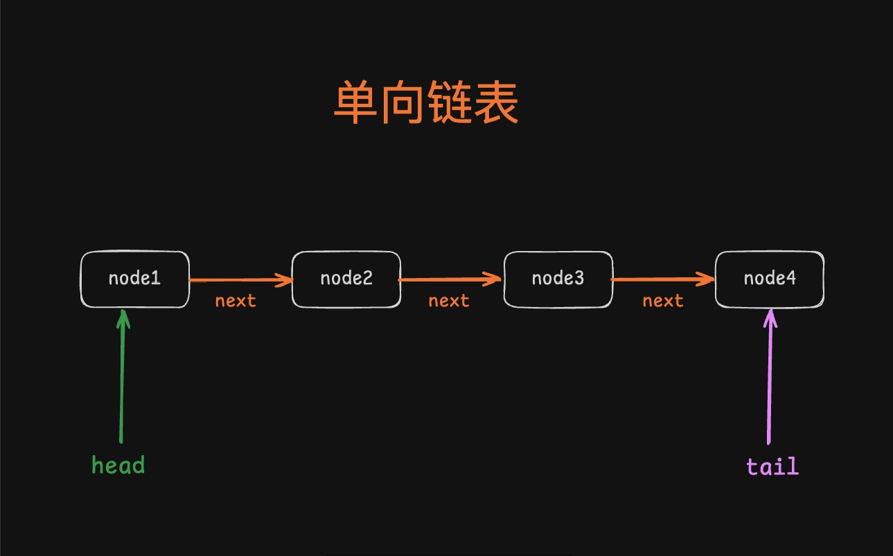
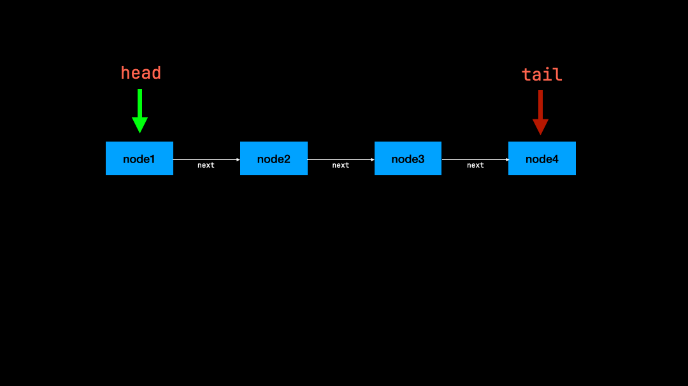
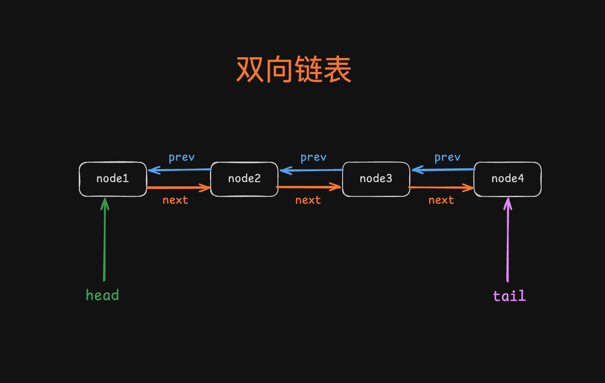

## 一、什么是链表？
链表（Linked List）是一种数据结构，它由一系列节点（Node）组成，每个节点存储一个数据值，并且指向下一个节点，他和数组一样，都是线性数据结构。

链表和数组的区别：
* **数组：** 查找元素速度更快（O(1)），这里指通过索引查找，但增删元素需要移动其他元素，效率较低（O(n)）
* **链表：** 增删元素更快（O(1)），但查找元素需要遍历整个链表（O(n)）

## 二、单向链表

在单向链表中，通常会有一个**头节点（必须）和尾节点（非必须）**

**head：** 头节点，表示链表的第一个节点，如果需要遍历这个链表，需要从它开始，对应图中**node1**<br/>
**tail：** 尾节点，表示链表最后一个节点，对应图中**node4**

在这个结构中可以看出，链表的**头节点（head）** 是`node1`，通过`node1`的`next`属性可以访问到`node2`，每一个节点都有一个`next`属性，指向下一个节点，直到最后一个节点`node4`，在这个案例中`node4`是最后一个节点，为**尾结点（tail）**

链表和数组都是线性数据结构，链表对比数组有什么优势呢

以下是链表和数组在新增和删除操作时的对比案例：
* 数组
```ts
const arr = ['a', 'b', 'c', 'd'] // a=>0  b=>1  c=>2  d=>3
// 删除数组的第一项
arr.shift()

console.log(arr) // ['b', 'c', 'd'] b=>0  c=>1  d=>2
```
初始化的时候生命了一个数组`arr`，然后调用`arr.shift()`删除数组第一个元素，此时移除第一个元素后，数组的所有元素的索引都会变动，都需要往前移动一位，这样是比较耗费性能的。
* 链表
```ts
// 头节点是 head
let head = {
    value: 1,
    next: {
        value: 2,
        next: {
            value: 3,
            next: {
                value: 4,
                next: null
            }
        }
    }
}

// 删除链表的第一项
head = head.next // 将头节点指向下一个节点 node2

console.log(head) // 输出新的头节点 [2, 3, 4]
```
看一下这个图片

`node1`只需要让`head`指向`head.next`，这样`node2`就成为新的头节点，而`node1`会被垃圾回收自动释放。
### 对比总结
只针对头节点操作，不考虑移除中间节点
* **数组：**
    * 新增操作需要移动后续元素，可能导致性能下降（O(n)）。
    * 删除操作同样需要移动后续元素，性能也为O(n)。
* **链表：**
    * 新增操作只需修改指针，性能为O(1)
    * 删除操作也只需修改指针，性能为O(1)。

通过上面的案例知道，链表的节点新增和删除动作，是会比数组要快的，但是只是删除了头节点，如果需要删除中间某一个节点呢，这个时候仅靠单向链表也能做到：
```ts
// 头节点是 head
let head = { value: 1, next: undefined }

const node2 = { value: 2, next: undefined }

const node3 = { value: 3, next: undefined }

const node4 = { value: 4, next: undefined }

// 建立链表之间的关系
head.next = node2
node2.next = node3
node3.next = node4

// ，假设现在手里只有 node3

// 现在我们要把 node3 删掉
let current = head
while (current) {
  // 找到 node3 的上一个节点
  if (current.next === node3) {
    // 把 node3 的上一个指向 node3 的下一个
    current.next = node3.next
    break
  }
  current = current.next
}

console.log(head) // 输出新的链表 [1, 2，4]
```

## 三、双向链表
单向链表，它存在一个问题，就是它不能快速的往前面添加节点，比如在下面这个案例中，我们在`node3`前面添加一个节点，这个时候我们很难直接通过`node3`把新节点和`node2`关联起来，当然你可以通过遍历的方式拿到`node2`，但是这样时间复杂度就比较高了，有没有什么快速删除的方式呢？有的

**这就是双向链表结构图**

此时每个节点都有一个属性`prev`指向他的上一个节点，如果我们需要在`node3`前面添加`node5`，可以通过`node3`的`prev`拿到`node2`，这个时候手里有三个节点`node2`、`node3`、`node5`，只需要把`node2`的`next`指向`node5`，`node5`的`next`指向`node3`
```ts
// 假设链表的头节点是 head

let head = { value: 1, next: undefined, prev: undefined }

const node2 = { value: 2, next: undefined, prev: undefined }

const node3 = { value: 3, next: undefined, prev: undefined }

const node4 = { value: 4, next: undefined, prev: undefined }

// 建立链表之间的关系
head.next = node2
// node2 的上一个节点指向 head
node2.prev = head
// node2 的下一个指向 node3
node2.next = node3
// node3 的上一个节点指向 node2
node3.prev = node2
// node3 的下一个指向 node4
node3.next = node4
// node4 的上一个指向 node3
node4.prev = node3

//假设现在手里只有 node3 ,把 node3 删掉

// 如果 node3 有上一个，那就把上一个节点的下一个指向 node3 的下一个
if (node3.prev) {
  node3.prev.next = node3.next
} else {
  head = node3.next
}

if (node3.next) {
  node3.next.prev = node3.prev
}
console.log(head) // 输出新的链表 [1, 2, 4]
```