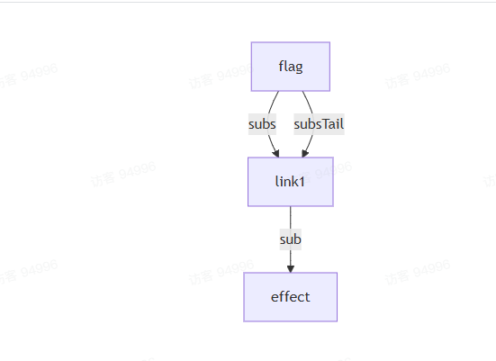
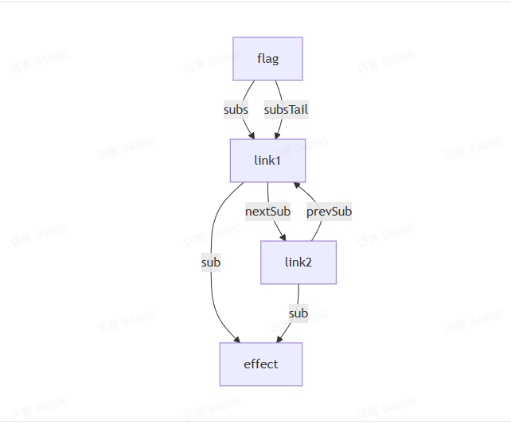
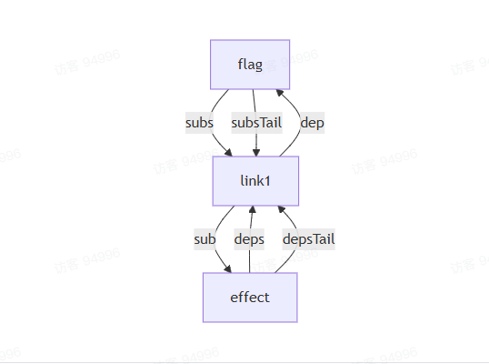
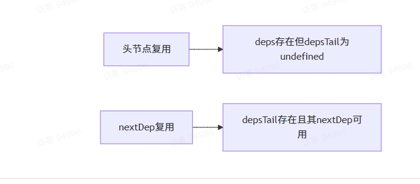
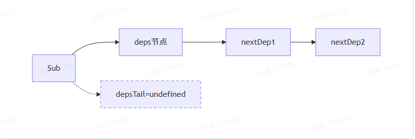
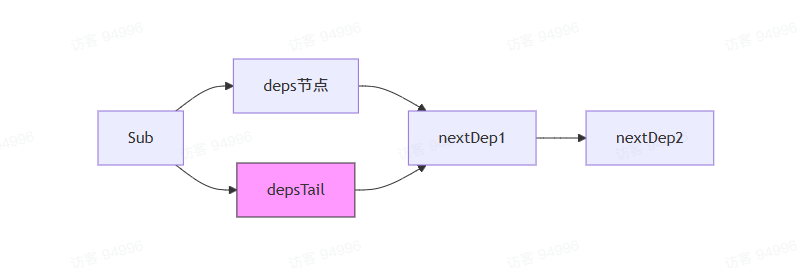
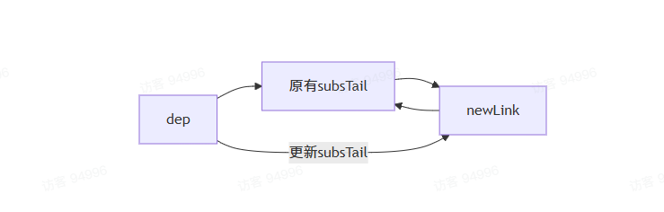
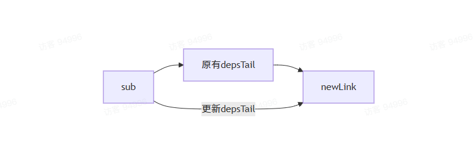

### dep和sub双向连接
看一个示例：
```ts
const flag = ref(false)

effect(() => {
    console.count(flag.value)
})

btn.onClick(() => {
    flag.value = !flag.value
})
```
上述代码执行完成后`flag`的依赖链表节点如下：

当点击按钮，会触发`effect`重新执行，这次执行，必然会触发`flag`的`get`，从而在次收集依赖，链表的结构就变成了这样：

此时`flag`的订阅者链表中已经有了两个节点，并且他们同时指向一个`effect`，这必然会导致一次更行触发多次`effect`。

既然`dep`可以通过链表的节点找到`sub`，那么也可以让`sub`通过链表的节点找到`dep`，这样每次重新执行的时候，看一下`sub`和`dep`之间，有没有关联，如果有，就不重新创建了。于是给链表设计成了这种结构：
```ts
/**
 * 依赖项
 */
interface Dep {
    // 订阅者链表头节点
    subs: Link | undefined
    // 订阅者链表尾结点
    subsTail: Link | undefined
}

// 订阅者
interface Sub {
    // 依赖项链表的头节点
    deps: Link | undefined
    // 依赖项链表尾结点
    depsTail: Link | undefined
}

// 链表节点
export interface Link {
    // 订阅者
    sub: Sub
    // 下一个订阅者节点
    nextSub: Link | undefined
    // 上一个订阅者节点
    pervSub: Link | undefined
    // 依赖项
    dep: Dep
    // 下一个依赖项节点
    nextDep: Link | undefined
}
```
这样链表里面就同时保存了`dep`和`sub`，并且给`ReactiveEffect`加一个单向链表，让他在重新执行时，可以找到自己之前收集到的依赖，尝试复用：
```ts
class ReactiveEffect {
    // 依赖项链表头节点
    deps: Link | undefined
    // 依赖项链表尾结点
    depsTail: Link | undefined
     // 省略后续代码...
}
```
然后在`effect`执行的时候，要创建`sub`和`link`之间的关联关系。怎么创建？和`dep`一样，在`link`中创建：
```ts
// 链表连接关系
export function link(dep, sub) {
    const newLink = {
        sub,
        dep,
        nextDep: undefined,
        nextSub: undefined,
        pervSub: undefined,
    }

    if (dep.subsTail) {
        // 如果尾结点存在，证明不是第一次触发，那么就把新节点加到尾结点后面
        dep.subsTail.nextSub = newLink
        // 把新节点的prevSub指向当前的尾结点
        newLink.prevSub = dep.subsTail
        // 更新当前的尾结点为最新的link
        dep.subsTail = newLink
    } else {
        // 如果尾结点不存在，证明是第一次触发，那么就把新节点作为头结点和尾结点
        dep.subs = newLink
        dep.subsTail = newLink
    }

    if(sub.depsTail) {
        sub.depsTail.nextDep = newLink
        sub.depsTail = newLink
    } else {
        sub.deps = newLink
        sub.depsTail = newLink
    }
}
```
这样首次运行完之后，结构就变成了这样：

那么当`effect`执行完毕后，会收集依赖。当`effect`被通知更新的时候，把`depsTail`设置成`undefined`

那么现在，`depsTail`指向`undefined`，`deps`指向`link1`。这种情况下，可以视为它之间收集过依赖，在重新执行的时候，需要尝试复用。尝试先复用第一个，然后一次往后。
```ts
class ReactiveEffect {
    run() {
        // 先将当前的 effect 保存起来，用来处理嵌套的逻辑
        const prevSub = activeSub

        // 每次执行fn之前，把this放到activeSub上
        activeSub = this

        // 开始执行前，将depsTail变成undefined
        this.depsTail = undefined

        try {
            return this.fn()
        } finally {
            // 执行完成后，恢复之前的 effect    activeSub = prevSub
        }
    }
}
```
那么这个时候，就是第一种情况，头节点有，尾结点没有，进行尝试复用依赖项：
```ts
export function link(dep, sub) {
    const currentDep = sub.depsTail
    // 如果尾节点没有，头节点有，那我们拿到头节点
    const nextDep = currentDep === undefined ? sub.deps : undefined
    // 看一下头节点有没有，如果头节点也有，那么我们看一下头节点的 dep 是不是等于当前我们要收集的 dep
    if (nextDep && nextDep.dep === dep) {
        // 相同，将尾节点指向头节点
        sub.depsTail = nextDep
        return
    }
}
```
还有另一种情况：就是多个依赖，此时肯定尾结点还是有`nextDep`的，于是需要进一步复用`nextDep`：
```ts
export function link(dep, sub) {
    //region 尝试复用链表节点
    const currentDep = sub.depsTail
    /**
     * 分两种情况：
     * 1. 如果头节点有，尾节点没有，那么尝试着复用头节点
     * 2. 如果尾节点还有 nextDep，尝试复用尾节点的 nextDep
     */
    const nextDep = currentDep === undefined ? sub.deps : currentDep.nextDep
    if (nextDep && nextDep.dep === dep) {
        sub.depsTail = nextDep
        return
    }
    //endregion
}
```

**总结需要复用 link 节点的两种情况：**
* 尾结点没有，头节点有，此时需要复用头节点
* 尾结点有`nextDep`需要进一步复用`nextDep`

### 节点复用
```ts
/**
 * 依赖项
 */
interface Dep {
    // 订阅者链表的头节点
    subs: Link | undefined
    // 订阅者链表的尾节点
    subsTail: Link | undefined
}

/**
 * 订阅者
 */
interface Sub {
    // 依赖项链表的头节点
    deps: Link | undefined
    // 依赖项链表的尾节点
    depsTail: Link | undefined
}

/**
 * 链表节点
 */
export interface Link {
    // 订阅者
    sub: Sub
    // 下一个订阅者节点
    nextSub: Link | undefined
    // 上一个订阅者节点
    prevSub: Link | undefined
    // 依赖项
    dep: Dep
    // 下一个依赖项节点
    nextDep: Link | undefined
}
```
每次触发`effect`，都需要重新收集依赖，但是针对那些已经收集过的依赖，就不需要重新收集了。所以需要尝试复用收集过的依赖。但是需要知道，当前次执行需要复用的依赖项，所以，每次开始执行`fn`的时候，先把`depsTail`置空
```ts
class ReactiveEffect {
    run() {
         // 先将当前的 effect 保存起来，用来处理嵌套的逻辑
        const prevSub = activeSub
        // 每次执行 fn 之前，把 this 放到 activeSub 上面
        activeSub = this

        // ⭐️ 每次执行 fn 之前，先把 depsTail 置空
        this.depsTail = undefined

        try {
            return this.fn()
        } finally {
            // 执行完成后，恢复之前的 effect
            activeSub = prevSub
        }
    }
}
```
这样就可以明确知道，一下两种情况是需要复用节点的：


#### 复用逻辑
```ts
// 先拿到尾节点
const currentDep = sub.depsTail
/**
 * 分两种情况：
 * 1. 如果头节点有，尾节点没有，那么尝试着复用头节点
 * 2. 如果尾节点还有 nextDep，尝试复用尾节点的 nextDep
 */ const nextDep = currentDep === undefined ? sub.deps : currentDep.nextDep
if (nextDep && nextDep.dep === dep) {
    sub.depsTail = nextDep
    return
}
```
#### 头节点复用

当`depsTail`为`undefined`时，会尝试复用`deps`（头结点）。

#### nextDep复用

当`depsTail`存在时，会尝试复用`depsTail.nextDep`，就是`nextDep2`

复用的核心条件是：
```ts
if(nextDep && nextDep.dep === dep)
```
这个条件确保：
1. 待复用的节点存在
2. 待复用节点的依赖项与当前依赖项相同

补充：
1. `deps`有，`depsTail`没有，表示收集的第一个依赖，因为在执行`effect.fn`之前，已经把`depsTail`设置成`undefined`了，所以这个时候尝试**复用链表的头节点**，链表头结点复用完成后，需要把`depsTail`指向当前已经复用成功的节点(就是deps)，此时头尾相同，注意：此时有可能`depsTail`还有`nextDep`，因为头节点可能有下一个节点
2. 如果`depsTail.nextDep`有，表示本次执行是重新执行，并且头节点已经复用完毕，此时需要尝试复用的节点就是`depsTail.nextDep`

#### 复用失败后的处理
如果无法复用节点，系统会创建新的链表节点并建立双向连接：
```ts
const newLink = {
    sub,
    dep,
    nextDep,
    nextSub: undefined,
    prevSub: undefined
}
```
然后分别建立与`dep`和`sub`的关联关系：

#### 与dep建立关联

#### 与sub建立关联
