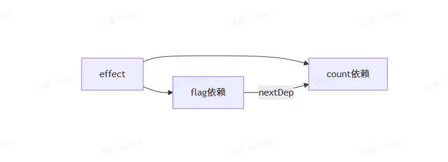
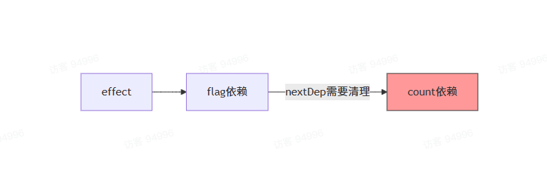
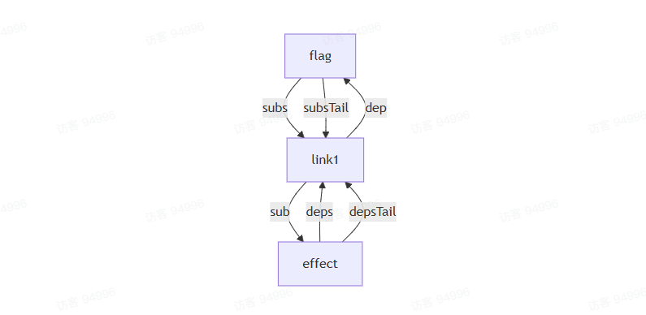
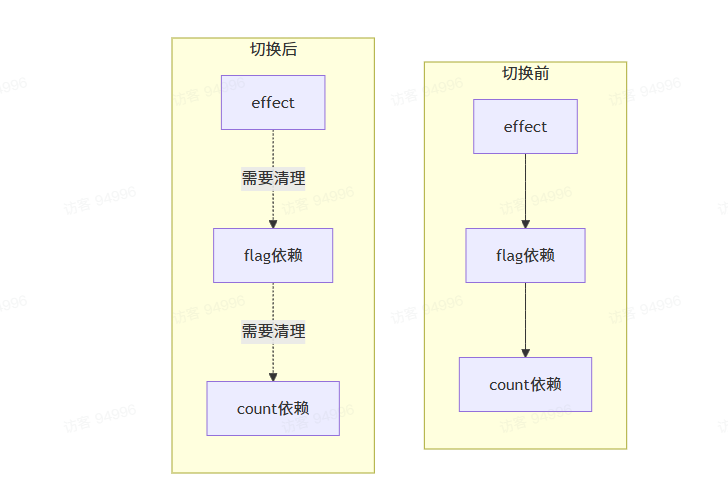

## 分支切换
通过一个例子具体说明一下：
```ts
const count = ref(0)
const flag = ref(true)

effect(() => {
    if(flag.value) {
        console.log(count.value)
    } else {
        console.log('不收集了')
    }
})

setTimeout(() => {
    flag.value = false
}, 1000)
```
初始化的时候，`effect`访问`flag`和`count`，此时会收集到两个依赖，当一秒钟后，定时器触发`flag.value = false`，应该走`else`的逻辑，`count`变化就不应该触发`effect`了。
### 依赖收集过程
首次执行的时候`flag`为`true`

此时的数据结构为：
```ts
effect.deps = {
    dep: flag的依赖,
    nextDep: {
        dep: count依赖,
        nextDep: undefined
    }
}
effect.depsTail = count依赖对应的Link
```
当`flag.value`变为`false`时：


### 清理过程
怎样拿到需要清理的依赖
```ts
const newLink = {
    sub,
    dep,
    nextDep, // 这里的nextDep来自于之前复用失败的依赖
    nextSub: undefined,
    prevSub: undefined
}
```
这里的关键是`nextDep`的传递，它保留了原有的依赖链，为后续清理提供了依据。

在`endTrack`函数中：
```ts
export function endTrack(sub: Sub) {
    // 如果 depsTail 还有 nextDep，说明后面的依赖需要清理
    if(sub.depsTail?.nextDep) {
        // clearTracking 用来清理依赖，后续实现它，就是断开所有的关联关系
        clearTracking(sub,depsTail.nextDep)
        // 如果从尾节点后面开始的，那尾节点后面的就不要了，因为我们已经把它清理掉了
        sub.depsTail.nextDep = undefined
    }
    // 如果 depsTail 为空但 deps 存在，说明这次执行没有收集到任何依赖
    else if(!sub.depsTail && sub.deps) {
        clearTracking(sub.deps)
        sub.deps = undefined
    }
}

```
### 清理场景

当`flag.value`变为`false`时：
1. 只会收集`flag`的依赖
2. `depsTail`指向`flag`的`Link`
3. `depsTail.nextDep` 指向原来的 `count` 依赖
4. 此时 `depsTail.nextDep` 存在，触发清理

### 完全没有收集到依赖

例如：
```ts
effect(() => {
    if(false){
        console.log(count.value)
    }
})
```
此时：
1. `depsTail`为`undefined`（没有收集到任何依赖）
2. `deps`存在（之前的依赖）
3. 这种情况，从`deps`开始清理整个链表

### 清理函数实现
```ts
function clearTracking(link: Link) {
    while(link) {
         const { prevSub, nextSub, nextDep, dep } = link
         /**
         * 如果 prevSub 有，那就把 prevSub 的下一个节点，指向当前节点的下一个
         * 如果没有，那就是头节点，那就把 dep.subs 指向当前节点的下一个
         */

        if (prevSub) {
            prevSub.nextSub = nextSub
            link.nextSub = undefined
        } else {
            dep.subs = nextSub
        }

        /**
         * 如果下一个有，那就把 nextSub 的上一个节点，指向当前节点的上一个节点
         * 如果下一个没有，那它就是尾节点，把 dep.depsTail 只想上一个节点
         */
        if (nextSub) {
            nextSub.prevSub = prevSub
            link.prevSub = undefined
        } else {
            dep.subsTail = prevSub
        }

        link.dep = link.sub = undefined

        link.nextDep = undefined

        link = nextDep
    }
}
```

### 为什么要清理依赖？
1. 内存管理：防止内存泄漏
2. 性能优化：避免不必要的更新计算
3. 确保正确性：保证响应式系统的依赖关系准确性