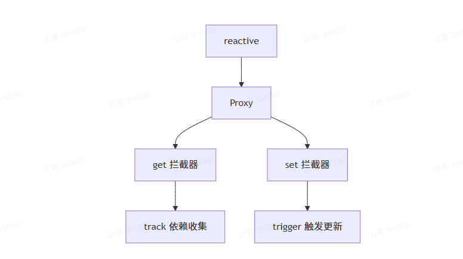
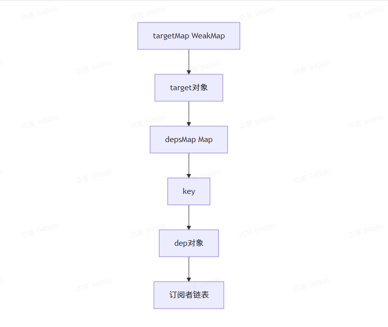
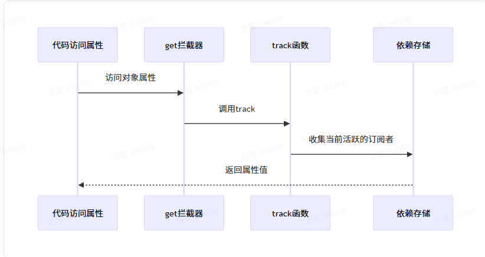
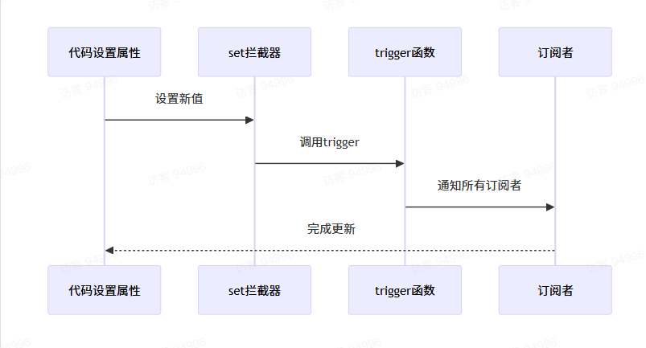

### reactive核心
`reactive`的核心是通过`Proxy`来拦截对象的操作，实现依赖收集和触发更新。


### 依赖收集的数据结构

* `targetMap`：存储所有响应式对象的依赖关系
* `depsMap`： 存储某个对象的所有属性依赖
* `dep`：存储某个属性的所有订阅者

### 实现流程

#### 创建响应式对象
```ts
export function reactive(target) {
    // reactive必须是一个对象参数
    if(!isObject(target)) {
        return target
    }

    // 看一下target在不在reactiveSet中，如果在，就证明已经是响应式，直接返回
    if(reactiveSet.has(target)) {
        return target
    }

    // 获取到之前这个 target 创建的代理对象
    const existingProxy = reactiveMap.get(target)

    if(existingProxy) {
        // 如果这个 target 之前使用 reactive 创建过响应式对象，那就直接返回这个响应式对象
        return existingProxy
    }

     /**
   * 创建 target 的代理对象
   */
    const proxy = new Proxy(target, mutableHandlers)
    /**
   * 保存 target 和 proxy 之间的关联关系
   * target => proxy
   */
    reactiveMap.set(target,proxy)

    return proxy
}
```
- mutableHandlers
```ts
export const mutableHandlers = {
    get(target, key, receiver) {
        // 收集依赖，绑定 target 中某一个 key 和 sub 之间的关系
        track(target, key)
        const res = Reflect.get(target, key, receiver)

        if(isRef(res)) {
            // 如果target.a 是一个 ref，那么就直接把值给它，不要让它 .value
            return res.value
        }

        if(isObject(res)) {
            // 如果 res 是一个对象，那么我就给它包装成 reactive
            return reactive(res)
        }

        // receiver 用来保证 访问器里面的 this 指向代理对象
        return res
    }
    set(target, key, newValue, receiver) {
        const oldValue = target[key]
        // 触发更新，set 的时候，通知之前收集的依赖，重新执行
        const res = Reflect.set(target, key, newValue, receiver)

        /**
         * 如果更新了 state.a 它之前是个 ref，那么会修改原始的 ref.value 的值 等于 newValue
         * 如果 newValue 是一个 ref，那就算了
         */
        if(isRef(oldValue) && !isRef(newValue)) {
             /**
             * const a = ref(0)
             * target = { a }
             * 更新 target.a = 1 ，它就等于更新了 a.value
             * a.value = 1
             */
            oldValue.value = newValue
            return res
        }

        if(hasChanged(newValue, oldValue)) {
            /**
             * 如果新值和老值不一样，触发更新
             * 先 set 再通知 sub 重新执行
             */
            trigger(target, key)
        }

        return res
    }
}
```
- dep.ts
```ts
import { Link, link, propagate } from './system'
import { activeSub } from './effect'

/**
 * 绑定 target 的 key 关联的所有的 Dep
 * obj = { a:0, b:1 }
 * targetMap = {
 *  [obj]:{
 *    a:Dep,
 *    b:Dep
 *  }
 * }
 */
const targetMap = new WeakMap()

export function track(target, key) {
    if (!activeSub) {
        return
    }
    /**
     * 找 depsMap = {
     *    a:Dep,
     *    b:Dep
     *  }
     */
    let depsMap = targetMap.get(target)

    if (!depsMap) {
        /**
         * 没有 depsMap，就是之前没有收集过这个对象的任何 key
         * 那就创建一个新的，保存 target 和 depsMap 之间的关联关系
         */
        depsMap = new Map()
        targetMap.set(target, depsMap)
    }
    /**
     * 找 dep => Dep
     */
    let dep = depsMap.get(key)

    if (!dep) {
        /**
         * 第一次收集这个对象，没找到，创建一个新的，并且保存到 depsMap 中
         */
        dep = new Dep()
        depsMap.set(key, dep)
    }
    /**
     * 绑定 dep 和 sub 之间的关联关系
     */
    link(dep, activeSub)
}

export function trigger(target, key) {
    console.log('target,key ==> ', target, key)
    /**
     * 找 depsMap = {
     *    a:Dep,
     *    b:Dep
     *  }
     */
    const depsMap = targetMap.get(target)

    if (!depsMap) {
        /**
         * depsMap 没有，表示这个对象，从来没有任何属性在 sub 中访问过
         */
        return
    }

    /**
     * 找到 key 对应的 Dep
     * key => Dep
     */
    const dep = depsMap.get(key)
    if (!dep) {
        // dep 不存在，表示这个 key 没有在 sub 中访问过
        return
    }

    /**
     * 找到 dep 的 subs 通知它们重新执行
     */
    propagate(dep.subs)
}

class Dep {
    /**
     * 订阅者链表的头节点，理解为我们将的 head
     */
    subs: Link

    /**
     * 订阅者链表的尾节点，理解为我们讲的 tail
     */
    subsTail: Link
    constructor() {}
}
```

#### 收集依赖过程
当访问响应式对象的属性时，会触发`get`拦截器：


#### 触发更新过程
当设置响应式对象的属性时，会触发`set`拦截器：


### 总结
`reactive`实现主要依靠
1. `Proxy`代理对象操作的拦截
2. 将对应的`target`和`key`通过`targetMap(WeakMap)`保存和`Dep`之前的关联关系
3. 通过`targetMap`找到`Dep`收集依赖和触发更新