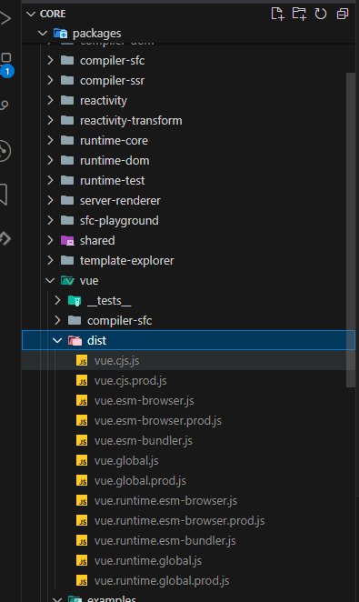
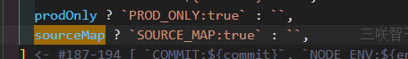
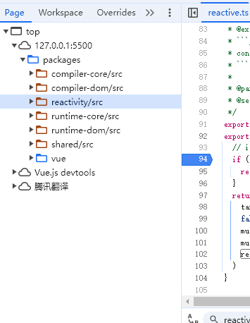
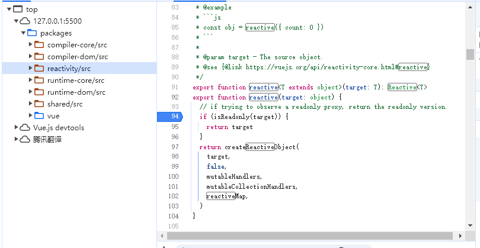
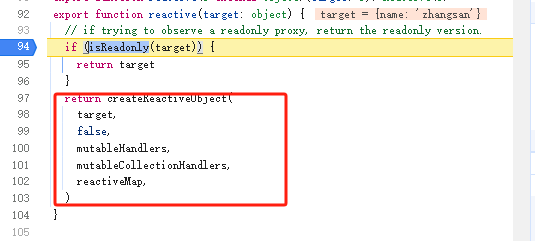
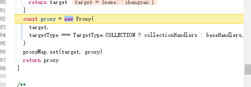

## 一、源码设计
### 1.1 源码目录结构
```
├── packages              // 核心代码
|   ├──  compiler-core         // 重要，编译器核心代码
|   ├──  compiler-dom          // 重要，浏览器相关编译模块
|   ├──  compiler-sfc          // 单文件组件(.vue)编译模块
|   ├──  compiler-ssr          // 服务端渲染的编译模块
|   ├──  reactivity            // 重要，响应性核心代码
|   ├──  reactivity-transform  // 已经过期，不需要关注
|   ├──  runtime-core          // 重要，运行时核心代码，内部针对不同台进行实现
|   ├──  runtime-dom           //
|   ├──  runtime-test          //
|   ├──  server-renderer       // 服务器渲染
|   ├──  sfc-playground        // sfc 工具：比如：https://play.vuejs.org/
|   ├──  shared                // 重要：共享的工具类
|   ├──  size-check            // 测试运行时包大小
|   ├──  template-explorer     // 提供一个线上的测试（https://template-explorer.vuejs.org）
|   ├──  vue                   // 重要：测试实例，打包之后的dist在这里
|   ├──  vue-compat            // 用于兼容vue2的代码
├── api-extractor.json    // TypeScript的API分析工具
├── CHANGELOG.md          // 更新日志
├── jest.config.js        // 测试相关
├── LICENSE               // 开源协议
├── netlify.toml          // 自动化部署相关
├── package.json          // npm包管理工具
├── pnpm-lock.yaml        // pnpm相关配置
├── pnpm-workspace.yaml   // pnpm下载的依赖包版本
├── rollup.config.js      // rollup 配置文件
├── SECURITY.md           //  报告漏洞
├── tsconfig.json         // TypeScript 配置文件
```
## 二、创建测试实例：在Vue源码中运行测试实例
### 1.运行vue3源代码
1. vue3是通过pnpm安装依赖的，所以需要安装pnpm
2. 在vue3源码根目录下运行
```
npm install -g pnpm
```
3. pnpm会通过一个集中管理的方式来管理电脑中所有项目的依赖包，以达到节约电脑的目的。
4. pnpm i 安装依赖
5. npm run build 打包
6. 执行完成之后，可以发现在packages/vue/dist下，将生成如下文件：

7. 项目打包完成

### 2.运行测试实例
1. 创建packages/vue/examples/sun 文件夹
2. 在当前文件夹下创建第一个测试实例：reactive.html，并写入如下代码

```html
<!DOCTYPE html>
<html lang="en">
<head>
    <meta charset="UTF-8">
    <meta name="viewport" content="width=device-width, initial-scale=1.0">
    <title>Document</title>
    <!-- 导入本地打包好的vue -->
    <script src="../../../dist/vue.global.js"></script>
</head>
<body>
    <div id="app"></div>
</body>

<script>
    const { reactive, effect } = Vue

    const obj = reactive({
        name: 'zhangsan'
    })

    effect(() => {
        document.querySelector('#app').innerText = obj.name
    })

    setTimeout(() => {
        obj.name = 'lisi'
    }, 2000)
</script>
</html>
````

3. 注意：改代码不可以直接放入浏览器运行
4. 运行代码需要启动一个服务
5. 在vscode中安装插件live server，启动本地服务
6. 安装完成之后，直接在html文件上，右键选择open with live server即可启动服务
7. 此时，我们可以发现，等待两秒之后，展示的文本由张三变为李四

## 三、跟踪解析运行行为：为vue开启SourceMap
如何对vue进行debugger，对vue进行debugger，需要开启SourceMap
### 开启vue的sourceMap
1. 在package.json中可以发现，当执行`npm run build`时，其实执行的是`node scripts/build.js`指令
2. 配置文件读取的是`scripts/build.js`这个文件
3. 文件中存在这样一行代码

4. 这里的sourceMap变量，决定了SOURCE_MAP:true 还是 ‘’
5. 这个值，最终会被设置到环境变量中，在`rollup.config.js`中，通过：
```js
 output.sourcemap = !!process.env.SOURCE_MAP
```
的形式赋值给了`output.sourcemap`

6. 而`output.sourcemap`决定了，最终的打包，是否会包含`sourcemap`
7. 修改命令：`"build": "node scripts/build.js -s",`
8. 我们在执行`npm run build`可以发现，打包出的所有文件都包含了一个xxx.map文件
9. 此时，我们就可以对vue进行debugger了

## 四、如何针对源码进行debugger
成功开启sourceMap后，在启动的测试项目，打开控制台，在sources模块下，可以看见如下内容：

我们此时使用了`reactive`方法声明的响应式对象，`reactive`方法对应的代码位置在`packages/reactivity/src/reactive.ts`中：

此时，已经可以对`reactive`的代码进行debugger了。

### 总结
1. 下载vue源代码，github上clone下载。
2. 为源代码开启`sourceMap`，以便后续进行`debugger`
3. 在`packages/vue/examples`中创建文件，导入`../../dist/vue.global.js`,编写测试实例
4. 通过`Live Server`启动服务
5. 在浏览器控制台的`Sources`中查看运行代码，并进行`debugger`

## 五、如何阅读源代码
### 1.阅读源代码的误区
误区：我需要把源代码中每一行代码都读明白<br/>
需要明确一点：阅读源码绝对不是要读明白其中每一行代码的意思，而是在众多的业务代码中寻找到主线，跟随这个主线来进行阅读
### 2.正确阅读源代码
1. 摒弃边缘情况
2. 跟随一条主线
#### 摒弃边缘情况
在大型项目的源码中，都会充斥着非常多的业务代码，这些业务代码是用来处理很多**边缘情况**的，如果过分深究这些业务代码则会让我们陷入到一个 代码泥潭 中，在繁琐的业务中找不到方向。所以，在阅读源码之前，必须要明确好一点，那就是：**仅阅读核心逻辑**
#### 跟随一条主线
对于像 vue 这种量级的项目来说，哪怕我们只去阅读它的核心代码，也是非常困难的。vue 的核心大致可以分为三块：
1. 响应性
2. 运行时
3. 编译器

以前面`/reactive.htm`为例：<br/>
通过`reactive`声明了一个响应式数据：
```js
const obj = reactive({
    name: 'zhangshan'
})
```
以当前代码为主线，查看 `reactive` 方法的主线逻辑：
1. 首先在 reactive 方法中进行了一个判断逻辑，判断 `target` 是否为只读的，如果是只读的就直接返回 `target`
2. 如果不是只读的，则触发 `createReactiveObject` 方法 ：

3. 在`createReactiveObject`方法中，又进行了一堆判断，最后返回了 `proxy` 实例对象，所以我们得到的 `obj` 应该就是一个 `proxy` 实例


## 六、开始创建自己的框架：创建vue-next-mini
不是用脚手架，从0到1，搭建一个项目
1. 创建`vue-next-mini`文件夹，通过vscode打开
2. 在终端中通过
```
npm init -y
```
创建`package.json`模块

3. 创建`packages`文件夹，作为：**核心代码**区域
4. 创建`packages/vue`文件夹：打包，测试实例，项目整体入口模块
5. 创建`packages/shared`文件夹：共享公共方法模块
6. 创建`packages/reactivity`文件夹：响应式模块
7. 创建`packages/compiler-dom`文件夹：浏览器部分编译模块
8. 创建`packages/compiler-core`文件夹：编译器模块
9. 创建`packages/runtime-dom`文件夹：浏览器部分运行时模块
10. 创建`packages/runtime-core`文件夹：运行时核心模块

## 七、为框架配置ts
1. 在根目录下创建`tsconfig.json`文件，
2. 在`tsconfig.json`中指定项目所需的**入口文件**和**编译器**配置
3. 也可以通过命令行生成`tsconfig.json`文件：
```
npm install typescript -g

tsc --init
```

4. 在`tsconfig.json`中配置：
```json
{
    "compilerOptions": {
        /* Visit https://aka.ms/tsconfig to read more about this file */
        // 根目录
        "rootDir": ".",
        // 严格模式标志
        "strict": true,
        // 指定类型脚本如何从给定的模块说明符查找文件。
        "moduleResolution": "node",
        // https://www.typescriptlang.org/tsconfig#esModuleInterop
        "esModuleInterop": true,
        // JS 语言版本
        "target": "es5",
        // 允许未读取局部变量
        "noUnusedLocals": false,
        // 允许未读取的参数
        "noUnusedParameters": false,
        // 允许解析 json
        "resolveJsonModule": true,
        // 支持语法迭代：https://www.typescriptlang.org/tsconfig#downlevelIteration
        "downlevelIteration": true,
        // 允许使用隐式的 any 类型（这样有助于我们简化 ts 的复杂度，从而更加专注于逻辑本身）
        "noImplicitAny": false,
        // 模块化
        "module": "esnext",
        // 转换为 JavaScript 时从 TypeScript 文件中删除所有注释。
        "removeComments": false,
        // 禁用 sourceMap
        "sourceMap": false,
        // https://www.typescriptlang.org/tsconfig#lib
        "lib": ["esnext", "dom"]
    },
    // 入口
    "include": [
        "packages/*/src"
    ]
}
```

## 八、引入代码格式化工具：prettier
1. 在插件中安装Prettier插件
2. 创建.prettierrc文件，并配置：
```json
{
    "semi": false,
    "singleQuote": true,
    "printWidth": 80,
    "trailingComma": "none", // 不尾随逗号
    "arrowParens": "avoid" // 箭头函数只有一个参数时，省略括号
}
```
## 九、模块打包器rollup

rollup 是一个 JavaScript 模块打包器，可以将小块代码编译成大块复杂的代码，例如 library 或应用程序。rollup 适合用来打包库，而webpack适合用来打包应用
1. 在项目根目录下创建`rollup.config.js`文件作为rollup的配置文件
```js
import resolve from '@rollup/plugin-node-resolve';
import commonjs from '@rollup/plugin-commonjs';
import typescript from '@rollup/plugin-typescript';

/**
 * 默认导出一个数组，数组的每一个对象都是一个单独的导出文件配置，详细可查：https://www.rollupjs
 */
export default [{
    // 入口文件
    input: 'packages/vue/src/index.ts',
    // 打包出口
    output: [
        // 导出一个iife模式的包
        {
            // 开启sourcemap
            sourcemap: true,
            // 导出文件地址
            file: './packages/vue/dist/vue.js',
            // 生成包的格式
            format: 'iife',
            // 变量名
            name: 'Vue',
        }
    ],
    // 插件
    plugins: [
        // ts
        typescript({
            sourceMap: true,
        }),
        // 解析node_modules中的模块,导入路径补全
        resolve(),
        // 支持commonjs模块
        commonjs(),
    ]
}]
```
依赖包版本：
```json
"devDependencies": {
 "@rollup/plugin-commonjs": "^22.0.1",
 "@rollup/plugin-node-resolve": "^13.3.0",
 "@rollup/plugin-typescript": "^8.3.4"
}
```
自此配置了一个基本的`rollup`的配置文件

然后再`input`路径下创建对应的index.ts，并写入代码：
```js
console.log('hello vue3')
```
因为使用的是`ts`，所以还需要安装：`tslib typescript`
```
npm i --save-dev tslib@2.4.0 typescript@4.7.4
```
配置完成

在`package.json`中，新增一个`scripts`：
```
"build": "rollup -c"
```
执行`npm run build`,进行打包。打包成功后，文件输出在目录：`\packages\vue\dist`下

## 十、配置路径映射
在当前的项目中， shared 文件夹内承担的是公开的工具方法，比如我们可以创建如下文件： packages/shared/src
```js
/**
 * 判断是否为一个数组
 */
export const isArray = Array.isArray
```
这个方法可能会在项目的多个地方被使用，所以我们可能会经常使用到如下代码`packages/vue/src/index.ts`：
```js
import { isArray } from '@vue/shared'
console.log(isArray([]))
```
期望可以通过`'@vue/shared'`来直接导入`packages/shared/src/index.ts`下的`isArray`方法。

那么如果想要达到这样的效果，那么就必须要设置`tsconfig`的**路径映射**功能。

在`tsconfig.json`中添加如下代码：
```js
{
    // 编辑器配置
    "compilerOptions": {
        ...
        // 设置快捷导入
        "baseUrl": ".",
        "paths": {
            "@vue/*": ["packages/*/src"]
        }
    }
}
```
这表示，我们可以通过 `@vue/*` 代替 `packages/*/src/index` 的路径

那么此时，我们的导入即可成功，可重新执行 `npm run build` 进行测试。