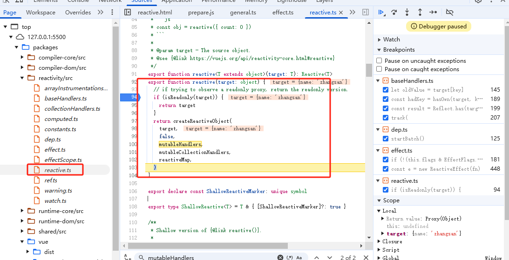
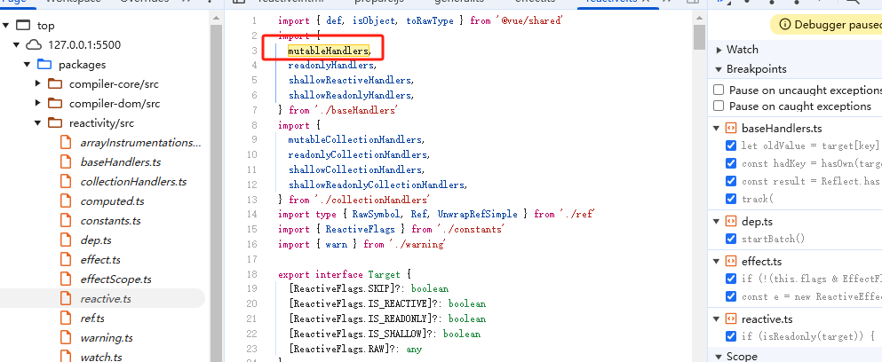
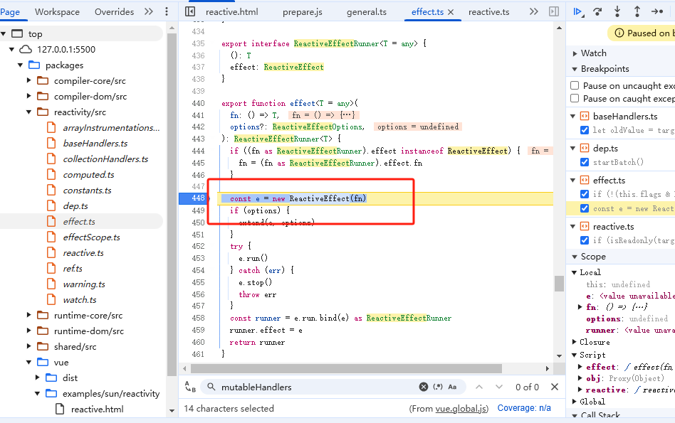
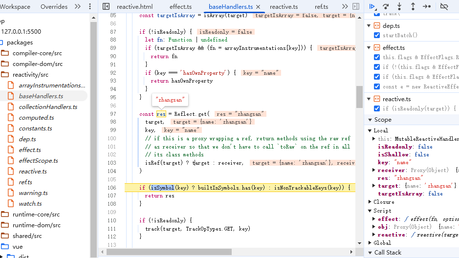
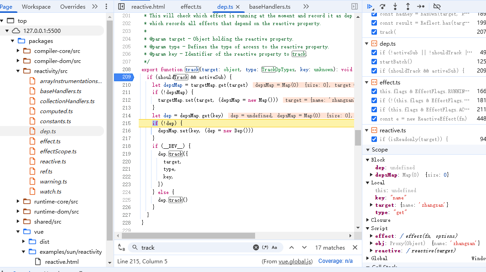
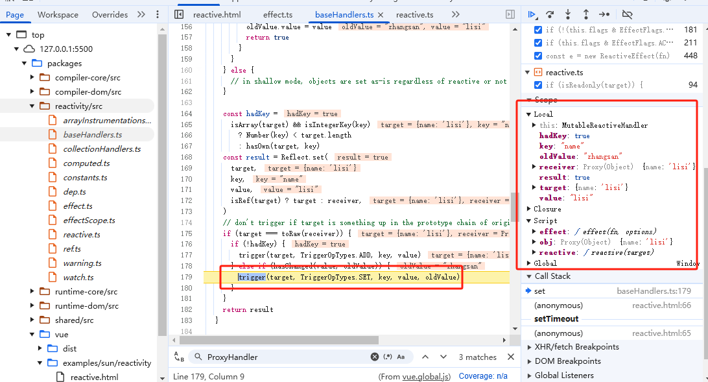
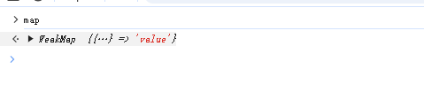
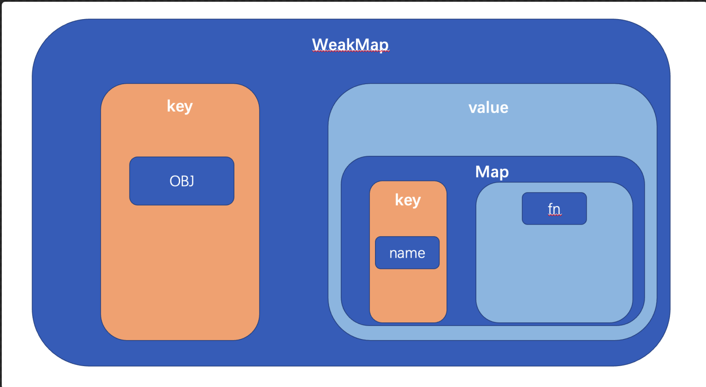
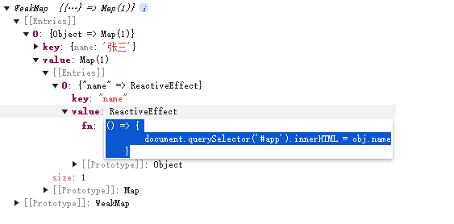

## 一、reactive的响应性
在目录2.2中创建了一个测试实例，在该实例中，通过`reactive`方法生命了一个响应性数据，通过`effect`注册了一个函数。

**跟踪**当前代码，看一下`vue`都做了什么
1. `reactive`做了什么？
2. `effect`是什么？

### reactive
1. 触发`reactive`方法
2. 创建`reactive`对象： `return createReactiveObject`
3. 进入`new Proxy`
    * 第一个参数`target`：传入的对象
    * 第二个参数`handle`：`targetType === TargetType.COLLECTION ? collectionHandlers : baseHandlers`，`TargetType.COLLECTION = 2，targetType = 1`，所以`handler`为`baseHandlers`
    * 那么`baseHandlers`是什么
4. 在`reactive`方法中可知，`baseHandlers`是触发`createReactiveObject`传递的第三个参数：`mutableHandlers`

5. `mutableHandlers`是`packages/reactivity/src/baseHandlers.ts`中导出的对象

6. 到`packages/reactivity/src/baseHandlers.ts`中，`mutableHandlers`是通过`new MutableReactiveHandler()`实现的，`MutableReactiveHandler`继承了`BaseReactiveHandler`,在`BaseReactiveHandler`中的`get`打一个断点，在`MutableReactiveHandler`中的`set`打一个断点
7. 因为`get`和`set`会在**取值**和**赋值的时候**触发，所以当前这两个断点**不会执行**
8. `reactive`方法内执行了`proxyMap.set(target, proxy)`方法
9. 返回了代理对象， `reactive`方法执行完成
10. 上述逻辑可知，对于`reactive`方法：
* 创建`proxy`
* 把`proxy`加到了`proxyMap`里面
* 返回proxy

### effect
#### 1. effect方法
在`packages/reactivity/src/effect.ts`第`440`行，可以找到`effect`方法，在这里给一个断点

#### 2. 执行 `new ReactiveEffect(fn)`
执行 `new ReactiveEffect(fn)`，其中的`fn`就是传入的匿名函数：

* 这里涉及一个类`ReactiveEffect`
* 分别在`run`和`stop`这个两个方法中**增加点断**
#### 3. 继续执行代码，执行了`run`方法
* 执行`return this.fn`触发fn函数
* `fn`函数就是**传入的匿名函数**，所以：`document.querySelector('#app').innerText = obj.name`
#### 4. `obj`是一个`proxy`，**`obj.name`**会**触发**`getter`，所以接下来会进入到`BaseReactiveHandler`的`get`中
1. 触发了方法:
```js
const res = Reflect.get(target, key, isRef(target) ? target : receiver)
```
2. 当前的`res`是`zhangsan`

3. 在下面触发了`track`函数：
    
    * `track`主要为`targetMap`进行赋值
    * 最后执行了`dep.track`
4. `track`的核心逻辑：收集`fn`
#### 5. 最后在`BaseReactiveHandler`中返回了`res（zhangsan）`，整个`effect`执行完成。

### 在页面中两秒之后会修改`obj.name`，此时会触发`setter`：
1. 两秒之后触发`setter`，会进入到`MutableReactiveHandler`的`set`中
2. 创建变量`oldValue = zhangsan`
3. `value = lisi`
4. 执行代码：
    ```js
        const result = Reflect.set(
            target,
            key,
            value,
            isRef(target) ? target : receiver,
        )
    ```
    修改了`obj`的值为`lisi`
5. 触发`trigger(target, TriggerOpTypes.SET, key, value, oldValue)`

6. `trigger`在这里为**触发**的意思：
    1. 首先执行：`const depsMap = targetMap.get(target)`，`targetMap`即在`track`中的。
    2. 然后执行到：`push(depsMap.get(key))`，即`fn`函数
    3. 然后触发了`notify`
7. `trigger`完成
8. `setter`回调完成
9. `setter`主要做了2件事情：
    * 修改`obj`的值
    * 触发`targetMap`保存`fn`函数

#### 总结
* 跟踪了整个实例中：
    1. `reactive`函数
    2. `effect`函数
    3. `obj.name = xx`表达式

* 三块代码主要做了：
    1. 创建`proxy`
    2. 收集`effect`的依赖
    3. 触发收集的依赖

## 二、框架实现：构建reactive函数，获取proxy实例
整个`reactive`函数，本质上就是返回一个`proxy`实例，
### 1. 创建 packages/reactivity/src/reactive.ts模块：
```js
import { mutableHandlers } from './baseHandlers'

/**
 * 响应性Map缓存对象
 * key：target
 * val：proxy
 */
export const reactiveMap = new WeakMap<object, any>()

/**
 * 为复杂数据类型，创建响应性对象
 * @param target 被代理对象
 * @returns 代理对象
 */
export function reactive(target: object) {
    return createReactiveObject(target, mutableHandlers, reactiveMap)
}

/**
 * 创建响应对象
 * @param target 被代理对象
 * @param baseHandlers handler
 */
function createReactiveObject(
    target: object,
    baseHandlers: ProxyHandler<any>,
    proxyMap: WeakMap<object, any>
) {
    // 如果该实例已经被代理，则直接读取即可
    const existingProxy = proxyMap.get(target)
    if (existingProxy) {
        return existingProxy
    }

    // 未被代理，则创建代理对象
    const proxy = new Proxy(target, baseHandlers)

    // 缓存代理对象
    proxyMap.set(target, proxy)
    return proxy
}

```
### 2. 创建`packages/reactivity/src/baseHandlers.ts`模块
```js
class BaseReactiveHandler implements ProxyHandler<object> {}

class MutableReactiveHandler extends BaseReactiveHandler {}

export const mutableHandlers: ProxyHandler<object> =
/*@__PURE__*/ new MutableReactiveHandler()

```

### 3. 此时已经构建好了一个基本的`reactive`函数，通过**测试案例**测试一下
### 4. 创建`packages/reactivity/src/index.ts`模块，作为`reactivity`的入口模块
```js
export { reactive } from './reactive'
```
### 5. 在`packages/vue/src/index.ts`中，导入`reactive`模块
```js
export { reactive } from '@vue/reactivity'
```
### 6. 执行`npm run build`进行打包，生成`vue.js`
### 7. `packages/vue/examples/reactivity/reactive.html`文件，作为测试实例：
```html
<!DOCTYPE html>
<html lang="en">
<head>
    <meta charset="UTF-8">
    <meta name="viewport" content="width=device-width, initial-scale=1.0">
    <title>Document</title>
    <script src="../../dist/vue.js"></script>
</head>
<body>
    
</body>
<script>
    const { reactive } = Vue;

    const obj = reactive({
        name: '张三'
    })

    console.log(obj)
</script>
</html>
```
### 8. 运行到`Live Server`，打印了一个`proxy`对象实例
### 9. 当前的`reactive`还存在的问题：
1. `WeakMap`是什么？它和`Map`有什么区别？
2. `mutableHandlers`是一个空的，如何实现
3. 每一次测试，都需要打包吗？

## 三、什么是WeakMap？和Map有什么区别？
`WeakMap`和`Map`，它两个有一个核心共同点，就是：**都是（key,value）的结构对象**

但是对于`WeakMap`而言，有两个不同的地方：
1. `key`必须是对象
2. `key`是弱引用的

**弱引用和强引用**
* 弱引用：不会影响垃圾回收机制，即：WeakMap的key**不再存在任何引用时，**会被直接回收。
* 强引用：会影响垃圾回收机制，存在强引用的对象永远**不会被回收**

示例：
```html
<script>
    // target对象
    let obj = {
        name: '张三'
    }
    // 声明 map对象
    const map = new Map()
    // 保存键值对
    map.set(obj,'value')
    // 清空obj
    obj = null
</script>
```
以上代码，在浏览器控制台中，打印map，打印结果如下：

即：**虽然`obj`已经不存在任何应用了，但是它并没有被回收哦，依然存在于`map`实例中，**这就证明`Map`是强引用，即便`obj`变为`null`，他依然存在于`Map`实例中。

用同样的代码，看看`WeakMap`：
```html
<script>
    // target对象
    let obj = {
        name: '张三'
    }
    // 声明 map对象
    const map = new WeakMap()
    // 保存键值对
    map.set(obj,'value')
    // 清空obj
    obj = null
</script>
```
上面代码在浏览器控制台打印，打印结果如下：

此时`WeakMap`中不存在任何值，即：`obj`**不存在其他引用时，`WeakMap`不会阻止垃圾回收，基于`obj`的引用将会被清除。**这就证明了`WeakMap`的**弱引用特性。**

**总结**
对于`WeakMap`而言，它存在两个比较重要的特性：
1. `key`必须是对象
2. `key`是弱引用的

## 四、框架实现：createGetter && createSetter
对于`proxy`而言，它的`handler`可以监听**代理对象**的`getter`和`setter`，那么`mutableHandlers`就是监听**代理对象**`getter`和`setter`的核心部分。

在`baseHandlers`中创建对的`get`和`set`监听，创建`packages/reactivity/src/effect.ts`，分别创建`track` `trigger`方法：

::: code-group
```ts [baseHandlers.ts]
import { track, trigger } from './effect'

/**
 * 响应性handler
 */
class BaseReactiveHandler implements ProxyHandler<object> {
    constructor(
        protected readonly _isReadonly = false,
        protected readonly _shallow = false
    ) {}

    /**
     * get方法
     */
    get(target: object, key: string | symbol, receiver: object): any {
        // 利用Reflect得到返回值
        const res = Reflect.get(target, key, receiver)
        // 收集依赖
        track(target, key)
        return res
    }
}

class MutableReactiveHandler extends BaseReactiveHandler {
    constructor(isShallow = false) {
        super(false, isShallow)
    }

    /**
     * setter回调方法
     */
    set(
        target: object,
        key: string | symbol,
        value: any,
        receiver: object
    ): any {
        // 利用Reflect.set 设置新值
        const result = Reflect.set(target, key, value, receiver)
        // 触发依赖
        trigger(target, key, value)
        return result
    }
}

export const mutableHandlers: ProxyHandler<object> =
    /*@__PURE__*/ new MutableReactiveHandler()

```
```ts [effect.ts]
/**
 * 收集依赖
 * @param target
 * @param key
 */
export function track(target: object, key: unknown) {
    console.log('track', target, key)
}

/**
 * 触发依赖
 */
export function trigger(target: object, key: unknown, newValue: unknown) {
    console.log('trigger')
}

```
:::
至此就可以：
1. 在`getter`时，调用`track`收集依赖
2. 在`setter`时，调用`trigger`触发依赖

测试：
在`packages/vue/examples/reactivity/reactive.html`中：

```html
<script>
    const { reactive } = Vue;

    const obj = reactive({
        name: '张三'
    })

    console.log(obj.name)

    obj.name = '李四'
</script>
```
**重新打包**项目，进行测试。

## 五、热更新的开发时：提升开发体验
在以上代码中，每次进行测试的时候，都需要执行一遍`npm run build`，有些过于麻烦。

在`package.json`文件中，现在只提供了一个`build`指令：
```json
"build": "rollup -c"
```
使用`build`可以打包项目，那么新增一个`dev`指令：
```json
"dev": "rollup -c -w"
```
`rollup -c -w` 表示：**-c读取配置文件，-w监听源文件是否有改动，如果有改动，重新打包**
通过当前命令启动，就可以得到一个`dev`的热更新状态。
执行`npm run dev`，然后修改代码，可以发现：**项目被重新打包了**

## 六、构建effect函数，生成ReactiveEffect实例
在创建好`reactive`实例之后，接下来需要触发`effect`：
```js
// 调用effect方法
effect(() => {
    document.querySelector('#app').innerText = obj.name
})
```
在`effect`中，生成了`ReactiveEffect`实例，并且触发了`getter(obj.name)`：
1. 在`packages/reactivity/src/effect.ts`中，创建`effect`函数：
```ts
/**
 * effect函数
 * @param fn 执行方法
 * return 以ReactiveEffect实例为this的执行函数
 */
export function effect<T = any>(fn: () = T) {
    // 生成ReactiveEffect实例
    const _effect = new ReactiveEffect(fn)
    // 执行run函数
    _effect.run()
}
```
2. 实现`ReactiveEffect`的基础逻辑：
```ts
/**
 * 单例的，当前的effect
 */
export let activeEffect: ReactiveEffect | undefined

/**
 * 响应性触发依赖时的执行类
 */
export class ReactiveEffect<T = any> {
    constructor(public fn: () => T){}

    run() {
        // 为activeEffect赋值
        activeEffect = this

        // 执行fn函数
        return this.fn()
    }
}
```
根据以上代码可知，最终`vue`会执行`effect`传入的回调函数，即：
```js
document.querySelector('#app').innerText = obj.name
```
那么此时，`obj.name`的值，应该可以被渲染到`html`中。

所以，可以在测试实例中，测试一下：
```html
<body>
    <div id="app"></div>
</body>
<script>
    const { reactive, effect } from 'vue'

    const obj = reactive({
        name: '张三'
    })

    // 调用effect方法
    effect(() => {
        document.querySelector("#app").innerText = obj.name
    })
</script>
```
此时，成功**渲染数据到HTML中**，那么接下来需要做的就是：**当`obj.name`触发`setter`时，修改视图**，以此就可以实现**响应性数据变化**

## 七、track && trigger函数
在`packages/reactivity/src/baseHandlers.ts`中的代码可知，当触发`getter`行为时，会触发`track`方法，进行**依赖收集**,当触发`setter`行为时，会触发`trigger`方法，来**触发依赖**：
1. 依赖收集：`track`
2. 触发依赖：`trigger`

什么是**依赖收集**和**触发依赖**

#### 什么是响应性？
* **当响应性数据触发`setter`时执行`fn`函数**
* 如何能在`setter`时，执行`fn`函数，那就必须在：**`getter`时能够收集当前的`fn`函数，以便在`setter`的时候可以执行对应的`fn`函数**
* 对于收集而言，仅仅保存`fn`是不够的，还需要知道，当前的`fn`是**哪个响应式数据对象**的**哪个属性**，才可以在**该属性**触发`setter`的时候，准确的执行响应性。

#### 如何进行依赖收集：
在`reactive`中创建过一个`WeakMap`：
```js
export const reactiveMap = new WeakMap<object, any>()
```
`WeakMap`它的`key`必须是一个对象，并且是弱引用的。
那么可以理解为：
```js
WeakMap:
    1.key: 响应性对象
    2.value：Map对象
        1. key：响应性对象的指定属性
        2. value：指定对象的指定属性的执行函数

```
图标表示：

这样就可以关联上**指定对象的指定属性**与**执行函数`fn`**之间的关系，当触发`setter`时，直接执行**对应对象的对应属性的`fn`**即可

## 八、构建track依赖收集函数
在`packages/reactivity/src/effect.ts`写入如下代码：
```ts
type KeyToDepMap = Map<any, ReactiveEffect>
/**
 * 收集所有的依赖的WeakMap实例：
 * 1. key：响应性对象
 * 2. value：Map对象
 *          1. key：响应性对象的指定属性
 *          2. value： 指定对象的指定属性的执行函数
 */
const targetMap = new WeakMap<any, KeyToDepMap>()
/**
 * 用于收集依赖的方法
 *  target WeakMap的key
 *  key 代理对象的key，当依赖被触发时，需要根据当前key获取
 */
export function track(target: object, key: unknown) {
    // 如果当前不存在执行函数，直接return
    if(!activeEffect) return
    // 从targetMap中根据target获取map
    let depsMap = targetMap.get(target)
    // 如果当前targetMap中不存在，则生成新的map对象，并把当前对象赋值给对应的value
    if(!depsMap){
        targetMap.set(target, (depsMap = new Map()))
    }
    // 为指定的map，指定key设置回调函数
    depsMap.set(key, activeEffect)
}
```
运行测试函数，查看打印的的`depsMap`，可以得到如下数据：

此时： **指定对象的指定属性对应的`fn`** 已经被成功保存到了`WeakMap`中了。

## 九、构建trigger触发依赖
在`packages/reactivity/src/effect.ts`中
```ts
/**
 * 触发依赖
 * target WeakMap中的key
 * key 代理对象的key 当依赖触发时，需要根据该key获取对应的effect
 */
export function trigger(target: object, key: unknown, newValue: unknown) {
    console.log('trigger')
    // 根据target获取存储的map实例
    const depsMap = targetMap.get(target)
    // 如果map不存在，则直接返回
    if (!depsMap) return
    // 根据key，从depsMap中取出value，当前value是一个ReactiveEffect类型的数据
    const effect = depsMap.get(key) as ReactiveEffect
    // 如果没有effect，则直接返回
    if (!effect) return
    //执行effect中保存的fn函数
    effect.fn()
}
```
此时，就可以在触发`setter`时，执行保存的`fn`函数。

在测试实例`packages/vue/examples/reactivity/reactive.html`中，进行测试：
```html
<script>
    const { reactive, effect } = Vue;

    const obj = reactive({
        name: '张三'
    })

    effect(() => {
        document.querySelector('#app').innerHTML = obj.name
    })

    setTimeout(() => {
        obj.name = '李四'
    }, 2000);
</script>
```
至此完成了一个简单的**响应性依赖数据处理**

## 十、总结：单一依赖的reactive
通过以上，已经构建了一个简单的`reactive`函数，使用`reactive`函数，配合`effect`，可以实现一个**响应性数据渲染**。
1. 首先在`packages/reactivity/src/reactive.ts`中，创建了一个`reactive`函数，当前函数生成一个`proxy`实例对象
2. 通过`proxy`实例的`handler`，可以监听到对应的`getter`和`setter`
3. 然后在`packages/reactivity/src/effect.ts`中，创建了一个`effect`函数，该函数可以创建一个`ReactiveEffect`的实例，该实例的构造函数可以接受传入回调函数`fn`，并且提供了一个`run`方法
4. 触发`run`可以为`activeEffect`进行赋值，并且执行`fn`函数
5. 在`fn`函数中触发`proxy`的`getter`，来激活`handler`的`get`函数
6. 在`handler`的`get`函数中，通过`WeakMap`收集**指定对象，指定属性**的`fn`，这样的操作叫做：**依赖收集**
7. 在**任意时刻**，修改`proxy`的数据，这样会触发`handler`的`setter`
8. 在`handler`中的`setter`中，会根据**指定对象**`target`的**指定属性`key`**来获取保存的**依赖**，然后触发依赖，达到修改数据的结果
