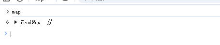

## 一、reactive的响应性
在目录2.2中创建了一个测试实例，在该实例中，通过`reactive`方法生命了一个响应性数据，通过`effect`注册了一个函数。

**跟踪**当前代码，看一下`vue`都做了什么
1. `reactive`做了什么？
2. `effect`是什么？

### reactive
1. 触发`reactive`方法
2. 创建`reactive`对象： `return createReactiveObject`
3. 进入`new Proxy`
    * 第一个参数`target`：传入的对象
    * 第二个参数`handle`：`targetType === TargetType.COLLECTION ? collectionHandlers : baseHandlers`，`TargetType.COLLECTION = 2，targetType = 1`，所以`handler`为`baseHandlers`
    * 那么`baseHandlers`是什么
4. 在`reactive`方法中可知，`baseHandlers`是触发`createReactiveObject`传递的第三个参数：`mutableHandlers`

5. `mutableHandlers`是`packages/reactivity/src/baseHandlers.ts`中导出的对象

6. 到`packages/reactivity/src/baseHandlers.ts`中，`mutableHandlers`是通过`new MutableReactiveHandler()`实现的，`MutableReactiveHandler`继承了`BaseReactiveHandler`,在`BaseReactiveHandler`中的`get`打一个断点，在`MutableReactiveHandler`中的`set`打一个断点
7. 因为`get`和`set`会在**取值**和**赋值的时候**触发，所以当前这两个断点**不会执行**
8. `reactive`方法内执行了`proxyMap.set(target, proxy)`方法
9. 返回了代理对象， `reactive`方法执行完成
10. 上述逻辑可知，对于`reactive`方法：
* 创建`proxy`
* 把`proxy`加到了`proxyMap`里面
* 返回proxy

### effect
#### 1. effect方法
在`packages/reactivity/src/effect.ts`第`440`行，可以找到`effect`方法，在这里给一个断点

#### 2. 执行 `new ReactiveEffect(fn)`
执行 `new ReactiveEffect(fn)`，其中的`fn`就是传入的匿名函数：

* 这里涉及一个类`ReactiveEffect`
* 分别在`run`和`stop`这个两个方法中**增加点断**
#### 3. 继续执行代码，执行了`run`方法
* 执行`return this.fn`触发fn函数
* `fn`函数就是**传入的匿名函数**，所以：`document.querySelector('#app').innerText = obj.name`
#### 4. `obj`是一个`proxy`，**`obj.name`**会**触发**`getter`，所以接下来会进入到`BaseReactiveHandler`的`get`中
1. 触发了方法:
```js
const res = Reflect.get(target, key, isRef(target) ? target : receiver)
```
2. 当前的`res`是`zhangsan`

3. 在下面触发了`track`函数：
    
    * `track`主要为`targetMap`进行赋值
    * 最后执行了`dep.track`
4. `track`的核心逻辑：收集`fn`
#### 5. 最后在`BaseReactiveHandler`中返回了`res（zhangsan）`，整个`effect`执行完成。

### 在页面中两秒之后会修改`obj.name`，此时会触发`setter`：
1. 两秒之后触发`setter`，会进入到`MutableReactiveHandler`的`set`中
2. 创建变量`oldValue = zhangsan`
3. `value = lisi`
4. 执行代码：
    ```js
        const result = Reflect.set(
            target,
            key,
            value,
            isRef(target) ? target : receiver,
        )
    ```
    修改了`obj`的值为`lisi`
5. 触发`trigger(target, TriggerOpTypes.SET, key, value, oldValue)`

6. `trigger`在这里为**触发**的意思：
    1. 首先执行：`const depsMap = targetMap.get(target)`，`targetMap`即在`track`中的。
    2. 然后执行到：`push(depsMap.get(key))`，即`fn`函数
    3. 然后触发了`notify`
7. `trigger`完成
8. `setter`回调完成
9. `setter`主要做了2件事情：
    * 修改`obj`的值
    * 触发`targetMap`保存`fn`函数

#### 总结
* 跟踪了整个实例中：
    1. `reactive`函数
    2. `effect`函数
    3. `obj.name = xx`表达式

* 三块代码主要做了：
    1. 创建`proxy`
    2. 收集`effect`的依赖
    3. 触发收集的依赖

## 二、框架实现：构建reactive函数，获取proxy实例
整个`reactive`函数，本质上就是返回一个`proxy`实例，
### 1. 创建 packages/reactivity/src/reactive.ts模块：
```js
import { mutableHandlers } from './baseHandlers'

/**
 * 响应性Map缓存对象
 * key：target
 * val：proxy
 */
export const reactiveMap = new WeakMap<object, any>()

/**
 * 为复杂数据类型，创建响应性对象
 * @param target 被代理对象
 * @returns 代理对象
 */
export function reactive(target: object) {
    return createReactiveObject(target, mutableHandlers, reactiveMap)
}

/**
 * 创建响应对象
 * @param target 被代理对象
 * @param baseHandlers handler
 */
function createReactiveObject(
    target: object,
    baseHandlers: ProxyHandler<any>,
    proxyMap: WeakMap<object, any>
) {
    // 如果该实例已经被代理，则直接读取即可
    const existingProxy = proxyMap.get(target)
    if (existingProxy) {
        return existingProxy
    }

    // 未被代理，则创建代理对象
    const proxy = new Proxy(target, baseHandlers)

    // 缓存代理对象
    proxyMap.set(target, proxy)
    return proxy
}

```
### 2. 创建`packages/reactivity/src/baseHandlers.ts`模块
```js
class BaseReactiveHandler implements ProxyHandler<object> {}

class MutableReactiveHandler extends BaseReactiveHandler {}

export const mutableHandlers: ProxyHandler<object> =
/*@__PURE__*/ new MutableReactiveHandler()

```

### 3. 此时已经构建好了一个基本的`reactive`函数，通过**测试案例**测试一下
### 4. 创建`packages/reactivity/src/index.ts`模块，作为`reactivity`的入口模块
```js
export { reactive } from './reactive'
```
### 5. 在`packages/vue/src/index.ts`中，导入`reactive`模块
```js
export { reactive } from '@vue/reactivity'
```
### 6. 执行`npm run build`进行打包，生成`vue.js`
### 7. `packages/vue/examples/reactivity/reactive.html`文件，作为测试实例：
```html
<!DOCTYPE html>
<html lang="en">
<head>
    <meta charset="UTF-8">
    <meta name="viewport" content="width=device-width, initial-scale=1.0">
    <title>Document</title>
    <script src="../../dist/vue.js"></script>
</head>
<body>
    
</body>
<script>
    const { reactive } = Vue;

    const obj = reactive({
        name: '张三'
    })

    console.log(obj)
</script>
</html>
```
### 8. 运行到`Live Server`，打印了一个`proxy`对象实例
### 9. 当前的`reactive`还存在的问题：
1. `WeakMap`是什么？它和`Map`有什么区别？
2. `mutableHandlers`是一个空的，如何实现
3. 每一次测试，都需要打包吗？

## 三、什么是WeakMap？和Map有什么区别？
`WeakMap`和`Map`，它两个有一个核心共同点，就是：**都是（key,value）的结构对象**

但是对于`WeakMap`而言，有两个不同的地方：
1. `key`必须是对象
2. `key`是弱引用的

**弱引用和强引用**
* 弱引用：不会影响垃圾回收机制，即：WeakMap的key**不再存在任何引用时，**会被直接回收。
* 强引用：会影响垃圾回收机制，存在强引用的对象永远**不会被回收**

示例：
```html
<script>
    // target对象
    let obj = {
        name: '张三'
    }
    // 声明 map对象
    const map = new Map()
    // 保存键值对
    map.set(obj,'value')
    // 清空obj
    obj = null
</script>
```
以上代码，在浏览器控制台中，打印map，打印结果如下：

即：**虽然`obj`已经不存在任何应用了，但是它并没有被回收哦，依然存在于`map`实例中，**这就证明`Map`是强引用，即便`obj`变为`null`，他依然存在于`Map`实例中。

用同样的代码，看看`WeakMap`：
```html
<script>
    // target对象
    let obj = {
        name: '张三'
    }
    // 声明 map对象
    const map = new WeakMap()
    // 保存键值对
    map.set(obj,'value')
    // 清空obj
    obj = null
</script>
```
上面代码在浏览器控制台打印，打印结果如下：

此时`WeakMap`中不存在任何值，即：`obj`**不存在其他引用时，`WeakMap`不会阻止垃圾回收，基于`obj`的引用将会被清除。**这就证明了`WeakMap`的**弱引用特性。**

**总结**
对于`WeakMap`而言，它存在两个比较重要的特性：
1. `key`必须是对象
2. `key`是弱引用的

## 四、框架实现：createGetter && createSetter
对于`proxy`而言，它的`handler`可以监听**代理对象**的`getter`和`setter`，那么`mutableHandlers`就是监听**代理对象**`getter`和`setter`的核心部分。

在`baseHandlers`中创建对的`get`和`set`监听，创建`packages/reactivity/src/effect.ts`，分别创建`track` `trigger`方法：

::: code-group
```ts [baseHandlers.ts]
import { track, trigger } from './effect'

/**
 * 响应性handler
 */
class BaseReactiveHandler implements ProxyHandler<object> {
    constructor(
        protected readonly _isReadonly = false,
        protected readonly _shallow = false
    ) {}

    /**
     * get方法
     */
    get(target: object, key: string | symbol, receiver: object): any {
        // 利用Reflect得到返回值
        const res = Reflect.get(target, key, receiver)
        // 收集依赖
        track(target, key)
        return res
    }
}

class MutableReactiveHandler extends BaseReactiveHandler {
    constructor(isShallow = false) {
        super(false, isShallow)
    }

    /**
     * setter回调方法
     */
    set(
        target: object,
        key: string | symbol,
        value: any,
        receiver: object
    ): any {
        // 利用Reflect.set 设置新值
        const result = Reflect.set(target, key, value, receiver)
        // 触发依赖
        trigger(target, key, value)
        return result
    }
}

export const mutableHandlers: ProxyHandler<object> =
    /*@__PURE__*/ new MutableReactiveHandler()

```
```ts [effect.ts]
/**
 * 收集依赖
 * @param target
 * @param key
 */
export function track(target: object, key: unknown) {
    console.log('track', target, key)
}

/**
 * 触发依赖
 */
export function trigger(target: object, key: unknown, newValue: unknown) {
    console.log('trigger')
}

```
:::
至此就可以：
1. 在`getter`时，调用`track`收集依赖
2. 在`setter`时，调用`trigger`触发依赖

测试：
在`packages/vue/examples/reactivity/reactive.html`中：

```html
<script>
    const { reactive } = Vue;

    const obj = reactive({
        name: '张三'
    })

    console.log(obj.name)

    obj.name = '李四'
</script>
```
**重新打包**项目，进行测试。
