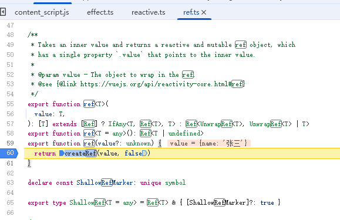
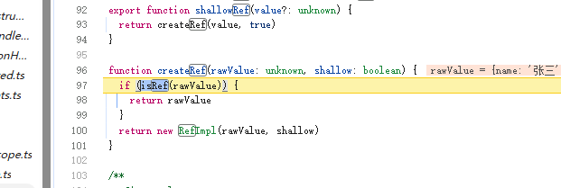
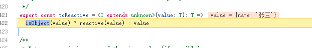
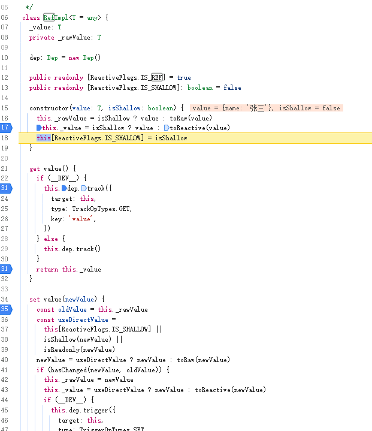
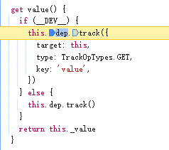
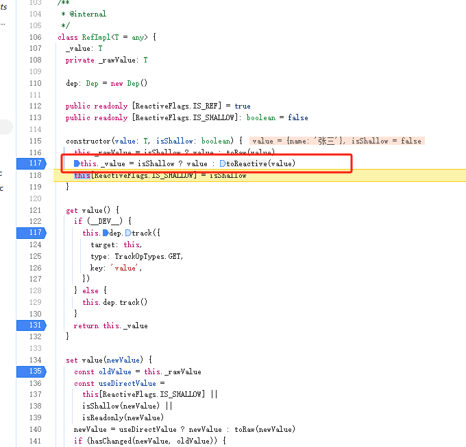

## 一、源码阅读：ref复杂数据类型的响应性
和`reactive`一样，看一下`ref`函数下，`vue3`的执行过程
1. 创建测试实例`packages/vue/examples/sun/ref.html`
```html
<!DOCTYPE html>
<html lang="en">
<head>
    <meta charset="UTF-8">
    <meta name="viewport" content="width=device-width, initial-scale=1.0">
    <title>Document</title>
    <!-- 导入本地打包好的vue -->
    <script src="../../../dist/vue.global.js"></script>
</head>
<body>
    <div id="app"></div>
</body>

<script>
    const { ref, effect } = Vue

    const obj = ref({
        name: '张三'
    })

    console.log(obj)

    effect(() => {
        document.querySelector('#app').innerText = obj.value.name
    })

    setTimeout(() => {
        obj.value.name = '李四'
    }, 2000)
</script>
</html>
```
2. 通过`Live Server`运行测试实例
3. `ref`的代码位于`packages/reactivity/src/ref.ts`之下，进行打断点。

### ref函数
1. `ref`函数中，直接触发`createRef`函数

2. 在`createRef`中，进行了判断如果当前已经是一个`ref`类型数据则直接返回，否则**返回**`RefImpl`**类型的实例**

3. `RefImpl`是什么？
    1. `RefImpl`是同样位于`packages/reactivity/src/ref.ts`下的一个类
    2. 构造函数中执行了一个`toReactive`方法，传入了`value`并把返回值赋值给了`this._value`。
        1. `toReactive`方法把数据分成了两种类型：
            1. 复杂数据类型：调用了`reactive`函数，把`value`变成了响应性的。
            2. 简单的数据类型：直接把`value`原样返回。
            
    3. 该类提供了一个分别被`get`和`set`标记的函数`value`
        1. 当执行`xxx.value`时，会触发`get`标记
    4. 到此`ref`函数执行成功。
    

由以上逻辑可知：
1. 对于`ref`而言，主要生成了`RefImpl`的实例
2. 在构造函数中对传入的数据进行了处理：
    1. 复杂数据类型：转为响应性的`proxy`实例
    2. 简单数据类型：不做处理
3. `RefImpl`分别提供了`get value、set value`以此来完成`getter`和`setter`的监听，注意这里并没有使用`proxy`

### effect函数
当`ref`函数执行完成之后，开始执行`effect`函数。

`effect`函数做了三件事情：
    1. 生成`ReactiveEffect`实例
    2. **触发`fn`方法，从而激活`getter`**
    3. 建立`targetMap`和`activeEffect`的联系
        1. `dep.add(activeEffect)`
        2. `activeEffect.deps.push(dep)`

通过以上可知，`effect`中会触发`fn`函数，也就是会执行`obj.value.name`，根据`get value`机制，会触发`RefImpl`的`get value`方法。

### get value()
1. 在`get value`中会触发`Dep实例的track`方法
    
2. 返回`this._value`

### 再次触发get value()

最后就是在两秒之后，修改数据源：
```js
obj.value.name = '李四'
```
这有一个关键问题： **此时会触发`get value 还是 set value`**
上述代码可以拆解为：
```js
const value = obj.value
```
通过以上代码可知，触发的是`get value`:

那么`this._value`是经过`toReactive`函数过滤之后的数据，也就是`reactive`，在当前的实例中为`proxy`实例


以上逻辑可知：
1. `const value`是`proxy`类型的实例，即：**代理对象**，被代理对象为:{name:'张三'}
2. 执行`value.name = '李四'`，本质上是触发了`proxy`的`setter`
3. 根据`reactive`的执行逻辑可知，此时会触发`trigger`触发依赖。修改视图。

### 总结
由以上逻辑可知：
1. 对于`ref`函数，会返回`RefImpl`类型的实例
2. 在该实例中，会根据传入的类型数据类型进行分开处理
    1. 复杂数据类型：转化为`reactive`返回`proxy`实例
    2. 简单数据类型：不做处理
3. 无论我们执行`obj.value.name`还是`obj.value.name = xxx`本质上都是触发了`get value`
4. 之所以会进行**响应性**是因为`obj.value`是一个`reactive`函数生成的`proxy`

另外`RefImpl`中的`set value`什么时候触发呢？
```js
// 场景1: 触发 RefImpl 的 set value
setTimeout(() => {
    console.log('场景1: 替换整个对象')
    obj.value = { name: '李四' }  // 触发 RefImpl.set value
}, 1000)
// 场景2: 不触发 RefImpl 的 set value，但会触发响应式更新
setTimeout(() => {
    console.log('场景2: 修改对象属性')
    obj.value.name = '王五'  // 不触发 RefImpl.set value，触发内部 reactive 的 setter
}, 2000)
// 场景3: 对于基本类型的 ref
const count = ref(0)
setTimeout(() => {
    console.log('场景3: 基本类型赋值')
    count.value = 1  // 触发 RefImpl.set value
}, 3000)
```

## 二、框架实现：ref函数-构建复杂数据类型的响应性
1. 创建`packages/reactivity/src/ref.ts`模块：
```ts
import { toReactive } from './reactive'
import { Dep, createDep } from './dep'
import { trackEffects, activeEffect } from './effect'

export interface Ref<T = any> {
    value: T
}

/**
 * ref函数
 * @param
 */
export function ref(value?: unknown) {
    // 创建一个RefImpl实例
    return createRef(value, false)
}

/**
 * 创建RefImpl实例
 * @param rawValue 原始数据
 * @param shallow boolean数据，表示浅层的响应性，即：只有.value是响应性的
 */
function createRef(rawValue: unknown, shallow: boolean) {
    if (isRef(rawValue)) {
        return rawValue
    }
    return new RefImpl(rawValue, shallow)
}

class RefImpl<T> {
    private _value: T
    public dep?: Dep = undefined

    // 是否为ref类型数据的标记
    public readonly __v_isRef = true
    constructor(value: T, isShallow: boolean) {
        // 如果isShallow为true，则value不会被转化reactive数据，
        this._value = isShallow ? value : toReactive(value)
    }

    /**
     * get语法将对象属性绑定到查询该属性时将被调用的函数。
     * 即：xxx.value 时触发该函数
     * @returns value
     */
    get value() {
        trackRefValue(this)
        return this._value
    }

    set value(newValue: T) {}
}

/**
 * ref 的 value 进行依赖收集
 */
export function trackRefValue(ref) {
    if (activeEffect) {
        trackEffects(ref.dep || (ref.dep = createDep()))
    }
}

/**
 *
 * @param 指定数据是否为 RefImpl 类型
 */
export function isRef(r: any): r is Ref {
    return !!(r && r.__v_isRef === true)
}

```
2. 在`packages/reactivity/src/reactive.ts`中，新增`toReactive`方法：
```ts
export const toReactive = <T extends unknown>(value: T): T =>
    isObject(value) ? reactive(value) : value
```
3. 在`packages/shared/src/index.ts`中，新增`isObject`方法：
```ts
export const isObject = (val: unknown) => {
    return val !== null && typeof val === 'object'
}

```
4. 在`packages/reactivity/src/index.ts`中，导出`ref`函数：
```ts
export { ref } from './ref'
```
5. 在`packages/vue/src/index.ts`，导出`ref`函数：
```ts
export { reactive, effect, ref } from '@vue/reactivity'

```
至此，`ref`函数构建完成。

在`packages/vu/examples/reactivity/ref.html`中：
```html
<script>
    const { ref, effect } = Vue;

    const obj = ref({
        name: '张三'
    })

    effect(() => {
        document.querySelector('#app').innerHTML = obj.value.name
    })

    setTimeout(() => {
        obj.value.name = '李四'
    }, 2000);
</script>

```
## 三、源码阅读：ref简单数据类型的响应性
1. 创建测试实例`packages/vue/examples/sun/ref-shallow.html`：
```html
<script>
    const { ref, effect } = Vue

    const obj = ref('张三')

    console.log(obj)

    effect(() => {
        document.querySelector('#app').innerText = obj.value
    })

    setTimeout(() => {
        obj.value = '李四'
    }, 2000)

</script>
```
利用ref创建一个**简单数据类型**的响应性。

### ref函数
整个`ref`初始化的流程与上面完全相同，但是有一个不同的地方：因为当前不是复杂数据类型，所以在`toReactive`函数中，不会通过`reactive`函数处理`value`。所以`this._value`**不是**一个`proxy`。即：**无法监听`setter`和`getter`**

### effect函数
整个`effect`函数中的和上面相同

### get value()
真个`effect`函数中引起的`get value()`流程与上面相同

### 大不同：set value()
延迟两秒中，将要执行`obj.value = '李四'`的逻辑。在复杂的数据类型下，这样的操作（`obj.value.name = '李四'`），其实是触发了`get value`行为。
但是，在简单的数据类型下，`obj.value = '李四'`触发的是`set value`，这里也是`ref`**可以监听到简单数据类型响应性的关键**。
1. 跟踪代码，进入到`set value(newValue)`：
    1. 通过`hasChanged`方法，对比数据是否发生变化
    2. 发生裱花，则触发`trigger`触发依赖

由上述可知：
1. 简单数据类型的响应性，不是基于`proxy`进行实现的，而是通过：`set value`**语法，将对象属性绑定到查询该属性时被调用的函数上**，使其触发`xxx.value = '李四'`属性时，其实是调用了`xxx.value('李四')`函数
2. 在`value`函数中，触发依赖

所以：对于`ref`标记的简单数据类型而言，他其实**并不具备响应性**，所谓响应性只不过是我们**主动触发了`value`方法**而
已

## 四、框架实现：ref函数-简单数据类型的响应性
1. `packages/reactivity/src/ref.ts`中，完善`set value`函数：
```ts
class RefImpl<T> {
    private _value: T
    private _rawValue: T

    public dep?: Dep = undefined

    // 是否为ref类型数据的标记
    public readonly __v_isRef = true
    constructor(value: T, isShallow: boolean) {
        this._rawValue = value
        // 如果isShallow为true，则value不会被转化reactive数据，
        this._value = isShallow ? value : toReactive(value)
    }

    /**
     * get语法将对象属性绑定到查询该属性时将被调用的函数。
     * 即：xxx.value 时触发该函数
     * @returns value
     */
    get value() {
        trackRefValue(this)
        return this._value
    }

    /**
     * newValue 为新数据
     * this._rawValue 为原始数据
     * 对比两个数据是否发生了变化
     *
     * @memberof RefImpl
     */
    set value(newValue: T) {
        if (hasChanged(newValue, this._rawValue)) {
            // 更新原始数据
            this._rawValue = newValue
            // 如果是浅层响应式，则不需要转换为响应式数据
            this._value = toReactive(newValue)
            // 触发依赖
            triggerRefValue(this)
        }
    }
}

/**
 * 触发 ref 的 触发依赖
 */

export function triggerRefValue(ref) {
    if (ref.dep) {
        triggerEffects(ref.dep)
    }
}
```
2. 在`packages/shared/src/index.ts`中，新增`hasChanged`方法
```ts
/**
 * 对比两个数据是否发生变化
 */
export const hasChanged = (value: any, oldValue: any): boolean => {
    return !Object.is(value, oldValue)
}
```
3. 在`packages/vue/examples/reactivity/ref-shallow.html`创建测试实例
```html
<script>
    const { ref, effect } = Vue;

    const obj = ref('张三')

    console.log(obj)

    effect(() => {
        document.querySelector('#app').innerText = obj.value
    })

    setTimeout(() => {
        obj.value = '李四'
    }, 2000)

</script>
```

## 五、总结
1. `ref`函数本质上是生成了一个`RefImpl`的实例对象，通过`get`和`set`标记处理`value`函数。
2. `ref`可以构建简单数据类型。
3. `ref`需要构建简单数据类型，但是简单数据类型，无法通过`proxy`建立代理。所以`vue`通过`get value()`和`set value()`两个属性函数，通过**主动**触发这两个函数（属性调用）的形式来进行**依赖收集**和**触发依赖**。所以需要`.value`来保证响应性。