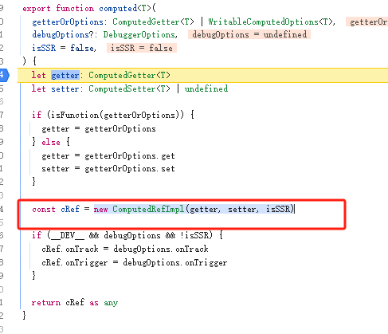

## 一、源码阅读，computed的响应性
创建测试实例：源码的`packages/vue/examples/sun/computed.html：`
```html
<script>
    const { reactive, computed, effect } = Vue
    const obj = reactive({
        name: '张三',
    })

    const computedObj = computed(() => {
        return obj.name + '同学'
    })

    effect(() => {
        document.querySelector('#app').innerText = computedObj.value
    })

    setTimeout(() => {
        obj.name = '李四'
    }, 2000)

</script>
```
以上测试实例中，主要执行了5个步骤：
1. 使用`reactive`创建响应性数据
2. 通过`computed`创建计算属性`computedObj`，并且触发了`obj`的`getter`
3. 通过`effect`方法创建`fn`函数
4. 在`fn`函数中，触发了`computed`的`getter`
5. 延迟触发了`obj`的`setter`

### computed
`computed`的代码在`packages/reactivity/src/computed.ts`中：
1. 在`computed`函数中：，通过`isFunction(getterOrOptions)`方法：
    1. `getterOrOptions`是传入的第一个参数，即：`() => {return obj.name + '同学'}`
2. 执行` getter = getterOrOptions`，`getter`即为传入的参数。
3. 执行`new ComputedRefImpl(getter, setter, isSSR)`，**创建`ComputedRefImpl`实例**

4.


